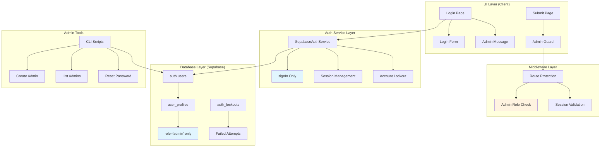

# Design Document - Admin Only Auth System

## Overview

WebVault管理员专用认证系统的技术设计，实现从开放式用户注册转向封闭式管理员认证的完整系统重构。该设计保持与现有Supabase认证架构的兼容性，同时简化用户管理复杂度，确保只有预定义的管理员账户能够访问内容管理功能。

## Steering Document Alignment

### Technical Standards (tech.md)
- **TypeScript严格模式**：所有新增代码遵循严格类型检查，提供完整类型定义
- **Supabase集成**：充分利用现有的Supabase认证基础设施，扩展而非替换
- **shadcn/ui组件系统**：UI组件沿用现有设计系统，保持视觉一致性
- **Next.js 15 App Router**：所有路由和页面组件遵循App Router最佳实践
- **安全最佳实践**：输入验证、XSS防护、CSRF保护完全集成到设计中

### Project Structure (structure.md)  
- **Feature First Architecture**：按功能模块垂直组织，认证功能自包含
- **lib/服务层**：核心认证服务放置在lib/auth/目录下
- **scripts/管理工具**：管理员管理脚本放置在scripts/admin/目录
- **中间件集成**：扩展现有src/middleware.ts而非创建新中间件
- **数据库迁移**：遵循Supabase migrations标准目录结构

## Code Reuse Analysis

### Existing Components to Leverage

**认证服务架构**：
- **SupabaseAuthService** (src/features/auth/services/SupabaseAuthService.ts): 扩展现有认证服务，移除signUp方法，保持signIn和会话管理逻辑
- **AuthService.interface** (src/features/auth/services/AuthService.interface.ts): 更新接口定义，移除注册相关方法签名
- **auth-store** (src/features/auth/stores/auth-store.ts): 复用现有状态管理，调整用户角色检查逻辑

**UI组件系统**：
- **LoginPage** (src/features/auth/components/LoginPage.tsx): 移除showFooter选项，隐藏注册相关UI
- **LoginPageFooter** (src/features/auth/components/LoginPageFooter.tsx): 禁用showSignUp选项，移除注册链接
- **AuthLayout** (src/features/auth/components/AuthLayout.tsx): 复用现有布局组件，更新标题文案

**中间件和路由保护**：
- **middleware.ts** (src/middleware.ts): 扩展现有ROUTE_CONFIGS，将/submit路由从requiresAuth:false改为requiresAuth:true,requiredRole:'admin'
- **supabase客户端** (src/lib/supabase.ts): 复用现有客户端配置，更新authConfig安全策略

### Integration Points

**数据库集成**：
- **现有user_profiles表结构**: 表已在SupabaseAuthService.ts中被引用，需要创建迁移文件完善表结构
- **auth_lockouts表**: SupabaseAuthService.ts已包含锁定逻辑，需要创建对应的数据库表结构
- **Supabase RLS策略**: 扩展现有的行级安全策略，限制只有admin角色能修改敏感数据

**API路由集成**：
- **现有API保护**: 复用middleware.ts中的API路由保护逻辑，确保管理员API只对admin角色开放
- **认证回调处理**: 保持现有的/auth/callback处理逻辑，无需修改

## Architecture

基于现有的Feature First Architecture，采用分层设计模式：



## Components and Interfaces

### Component 1: Database Schema Enhancement
- **Purpose**: 创建完善的用户管理和安全机制数据库结构
- **Files**: 
  - `supabase/migrations/001_admin_auth_system.sql`
  - `src/lib/types/database.types.ts` (更新类型定义)
- **Interfaces**: 
  ```typescript
  interface UserProfile {
    id: string;
    email: string;
    name: string | null;
    role: 'admin';
    avatar: string | null;
    created_at: string;
    updated_at: string;
  }
  
  interface AuthLockout {
    email: string;
    attempt_count: number;
    locked_until: string | null;
    updated_at: string;
  }
  ```
- **Dependencies**: Supabase PostgreSQL, 现有的auth.users表
- **Reuses**: 现有的数据库连接和RLS策略

### Component 2: Admin Management CLI
- **Purpose**: 提供命令行工具创建和管理管理员账户
- **Files**:
  - `scripts/admin/create-admin.ts`
  - `scripts/admin/list-admins.ts`
  - `scripts/admin/manage-admin.ts`
- **Interfaces**:
  ```typescript
  interface AdminManagerOptions {
    email: string;
    password?: string;
    name?: string;
    action: 'create' | 'list' | 'update' | 'delete' | 'reset-password';
  }
  
  interface AdminCreationResult {
    success: boolean;
    adminId?: string;
    error?: string;
  }
  ```
- **Dependencies**: Supabase Service Role Client, Zod (输入验证), 环境变量管理
- **Reuses**: src/lib/supabase.ts的supabaseServiceRole客户端
- **Security**: Service role key通过环境变量管理，不直接处理密码哈希(由Supabase Auth处理)

### Component 3: Enhanced Authentication Service
- **Purpose**: 移除注册功能，专注于管理员登录和会话管理
- **Files**:
  - `src/features/auth/services/SupabaseAuthService.ts` (修改)
  - `src/features/auth/services/AuthService.interface.ts` (修改)
- **Interfaces**:
  ```typescript
  interface AdminAuthService {
    // 移除 signUp 方法
    signIn(credentials: AuthFormData): Promise<AuthSession>;
    signOut(): Promise<void>;
    getCurrentUser(): Promise<AuthUser | null>;
    // 保留所有会话管理和安全功能
  }
  ```
- **Dependencies**: 现有的Supabase认证基础设施
- **Reuses**: 完全基于现有的SupabaseAuthService，仅移除注册功能

### Component 4: Route Protection Enhancement  
- **Purpose**: 更新中间件以限制管理员专用页面访问
- **Files**:
  - `src/middleware.ts` (修改ROUTE_CONFIGS)
- **Interfaces**: 保持现有的RouteConfig接口不变
- **Dependencies**: 现有的中间件基础设施
- **Reuses**: 
  - 现有的validateUserSession函数
  - 现有的createRedirectResponse逻辑
  - 现有的路由匹配机制

### Component 5: UI Component Updates
- **Purpose**: 清理登录界面，移除注册相关UI元素，增强管理员专用体验
- **Files**:
  - `src/features/auth/components/LoginPage.tsx` (修改props)
  - `src/features/auth/components/LoginPageFooter.tsx` (修改逻辑)
  - `src/app/(auth)/login/page.tsx` (更新元数据)
  - `src/features/auth/components/AuthGuard.tsx` (增强管理员权限检查)
  - `src/features/auth/components/AuthErrorBoundary.tsx` (优化错误处理)
- **Interfaces**: 更新现有组件props，移除注册相关选项，增加管理员标识
- **Dependencies**: 现有的shadcn/ui组件和样式系统
- **Reuses**: 完全基于现有的UI组件架构，充分利用AuthGuard和AuthErrorBoundary
- **Enhancements**: AuthGuard组件增强admin角色检查，AuthErrorBoundary提供管理员友好的错误信息

## Data Models

### Enhanced User Profile Model
```sql
-- 扩展现有user_profiles表
CREATE TABLE IF NOT EXISTS user_profiles (
  id UUID REFERENCES auth.users(id) ON DELETE CASCADE PRIMARY KEY,
  email TEXT NOT NULL UNIQUE,
  name TEXT,
  role TEXT NOT NULL DEFAULT 'admin' CHECK (role IN ('admin')),
  avatar TEXT,
  created_at TIMESTAMPTZ DEFAULT NOW(),
  updated_at TIMESTAMPTZ DEFAULT NOW()
);

-- 创建索引优化查询性能
CREATE INDEX idx_user_profiles_email ON user_profiles(email);
CREATE INDEX idx_user_profiles_role ON user_profiles(role);
```

### Auth Lockout Model  
```sql
-- 认证锁定机制表
CREATE TABLE IF NOT EXISTS auth_lockouts (
  email TEXT PRIMARY KEY,
  attempt_count INTEGER DEFAULT 0,
  locked_until TIMESTAMPTZ,
  updated_at TIMESTAMPTZ DEFAULT NOW()
);

-- 清理过期锁定记录的函数
CREATE OR REPLACE FUNCTION cleanup_expired_lockouts()
RETURNS void AS $$
BEGIN
  DELETE FROM auth_lockouts 
  WHERE locked_until IS NOT NULL 
    AND locked_until < NOW() - INTERVAL '1 hour';
END;
$$ LANGUAGE plpgsql;

-- 定期清理任务 (使用pg_cron扩展)
SELECT cron.schedule('cleanup-auth-lockouts', '0 * * * *', 'SELECT cleanup_expired_lockouts();');

-- 手动触发器 (用于高频率清理)
CREATE OR REPLACE FUNCTION trigger_cleanup_lockouts()
RETURNS trigger AS $$
BEGIN
  -- 每100次插入后执行一次清理
  IF (SELECT COUNT(*) FROM auth_lockouts) % 100 = 0 THEN
    PERFORM cleanup_expired_lockouts();
  END IF;
  RETURN NULL;
END;
$$ LANGUAGE plpgsql;

CREATE TRIGGER auth_lockouts_cleanup_trigger
  AFTER INSERT ON auth_lockouts
  EXECUTE FUNCTION trigger_cleanup_lockouts();
```

### Row Level Security Policies
```sql
-- 限制user_profiles表只能由管理员访问
ALTER TABLE user_profiles ENABLE ROW LEVEL SECURITY;

CREATE POLICY "Admin users can view all profiles" ON user_profiles
  FOR SELECT USING (auth.jwt() ->> 'role' = 'admin');

CREATE POLICY "Admin users can insert profiles" ON user_profiles  
  FOR INSERT WITH CHECK (auth.jwt() ->> 'role' = 'admin');

CREATE POLICY "Admin users can update profiles" ON user_profiles
  FOR UPDATE USING (auth.jwt() ->> 'role' = 'admin');
```

## Error Handling

### Error Scenarios

1. **场景1**: 非管理员用户尝试访问/submit页面
   - **处理**: 中间件检测角色权限，重定向到首页并显示友好提示
   - **用户影响**: 访客看到"该功能仅限管理员使用"信息，不影响其他功能

2. **场景2**: 账户锁定期间尝试登录
   - **处理**: 返回具体的锁定剩余时间，阻止进一步尝试
   - **用户影响**: 管理员看到"账户已锁定，请X分钟后再试"提示

3. **场景3**: 管理员脚本创建重复邮箱
   - **处理**: 验证邮箱唯一性，返回详细错误信息
   - **用户影响**: 系统管理员获得明确的重复邮箱警告

4. **场景4**: Supabase服务连接失败
   - **处理**: 实现重试机制，记录详细日志，降级到缓存会话
   - **用户影响**: 短期维持现有会话，后台自动恢复

5. **场景5**: 用户尝试直接调用注册API
   - **处理**: API返回404错误，中间件记录尝试日志
   - **用户影响**: 获得明确的功能不可用信息

## Testing Strategy

### Unit Testing
- **SupabaseAuthService**: 测试移除signUp后的服务功能完整性
- **中间件逻辑**: 验证路由保护和角色检查的准确性
- **CLI脚本**: 测试管理员创建、列表、删除功能
- **UI组件**: 确保移除注册选项后的界面正确渲染

### Integration Testing
- **认证流程**: 端到端测试管理员登录到访问/submit页面
- **权限控制**: 验证非管理员用户被正确阻止访问
- **数据库集成**: 测试用户创建和角色分配流程
- **会话管理**: 验证登录状态持久性和自动刷新
- **现有功能集成**:
  - 网站管理系统: 确保只有管理员能创建、编辑、删除网站
  - 博客推荐系统: 验证博客创作和发布权限限制
  - 搜索发现功能: 确保访客用户的完整搜索体验不受影响
  - 分类标签管理: 测试管理员对分类和标签的完全控制权限

### End-to-End Testing
- **管理员工作流**: 脚本创建管理员 → 登录 → 提交网站 → 退出
- **访客体验**: 访问首页 → 搜索内容 → 尝试访问管理功能被阻止
- **安全性验证**: 模拟暴力破解攻击，验证账户锁定机制
- **跨浏览器兼容性**: 确保在不同设备和浏览器上的一致体验

## Implementation Phases

### Phase 1: Database Foundation (高优先级)
- 创建数据库迁移文件
- 建立user_profiles和auth_lockouts表
- 配置RLS策略和索引优化

### Phase 2: Authentication Service Update (高优先级)  
- 移除SupabaseAuthService中的signUp相关方法
- 更新AuthService接口定义
- 调整错误处理和日志记录

### Phase 3: Admin Management Tools (中优先级)
- 开发CLI脚本创建管理员账户
- 实现账户列表和管理功能
- 添加密码重置和用户查询功能

### Phase 4: Route Protection & UI Updates (中优先级)
- 更新中间件路由配置
- 清理登录页面UI组件
- 更新页面元数据和文案

### Phase 5: Integration & Testing (低优先级)
- 端到端集成测试
- 性能优化和安全审计
- 文档更新和部署准备

## Security Considerations

### Service Role Key 管理
- **环境变量存储**: `SUPABASE_SERVICE_ROLE_KEY`必须通过环境变量管理，不得硬编码
- **密钥轮换策略**: 建议每90天轮换service role key，并更新所有部署环境
- **访问权限限制**: CLI脚本仅在服务器环境运行，不允许客户端直接访问
- **审计日志记录**: 所有使用service role的操作都记录时间戳、操作类型、IP地址

### 认证安全措施
- **最小权限原则**: 只保留必要的认证功能，移除所有注册入口
- **会话安全**: 保持现有的30天JWT令牌机制，定期刷新
- **输入验证**: 所有管理员创建输入使用Zod schema严格验证
- **密码策略**: 利用Supabase内置密码强度检查，无需额外哈希处理
- **锁定机制**: 5次失败尝试触发15分钟锁定，自动清理过期记录

### 数据库安全
- **RLS策略**: 确保只有admin角色能访问敏感数据
- **连接加密**: 所有数据库连接使用TLS 1.3加密
- **备份加密**: 数据库备份使用AES-256加密存储

## CLI Interface Specifications

### 管理员管理命令行接口

```bash
# 创建管理员账户
npm run admin:create --email=admin@example.com --password=SecurePass123 --name="Admin User"

# 列出所有管理员
npm run admin:list [--format=table|json] [--limit=20]

# 更新管理员信息
npm run admin:update --id=uuid-here --name="New Name" [--email=new@email.com]

# 删除管理员账户
npm run admin:delete --id=uuid-here [--confirm]

# 重置管理员密码
npm run admin:reset-password --email=admin@example.com [--password=NewPass123]

# 检查管理员状态
npm run admin:status --email=admin@example.com

# 解锁被锁定的管理员账户
npm run admin:unlock --email=admin@example.com
```

### CLI脚本返回格式
```typescript
interface CLIResponse {
  success: boolean;
  message: string;
  data?: {
    adminId?: string;
    email?: string;
    name?: string;
    createdAt?: string;
    role?: 'admin';
  };
  error?: {
    code: string;
    details: string;
    field?: string;
  };
}
```

### 环境变量要求
```bash
# 必需的环境变量
SUPABASE_SERVICE_ROLE_KEY=eyJhbGciOiJIUzI1NiJ9...
NEXT_PUBLIC_SUPABASE_URL=https://xxx.supabase.co
NODE_ENV=production

# 可选的安全配置
ADMIN_CLI_LOG_LEVEL=info
ADMIN_CLI_AUDIT_LOG=true
```

## Performance Optimizations

- **数据库索引**: 针对email和role字段创建复合索引，优化管理员查询性能
- **会话缓存**: 复用现有的session缓存机制，减少重复数据库查询
- **中间件优化**: 最小化权限检查的数据库查询，使用内存缓存角色信息
- **脚本性能**: 批量操作支持，避免单一事务超时，添加进度条显示
- **锁定清理**: 自动清理过期锁定记录，每小时执行一次，避免表膨胀