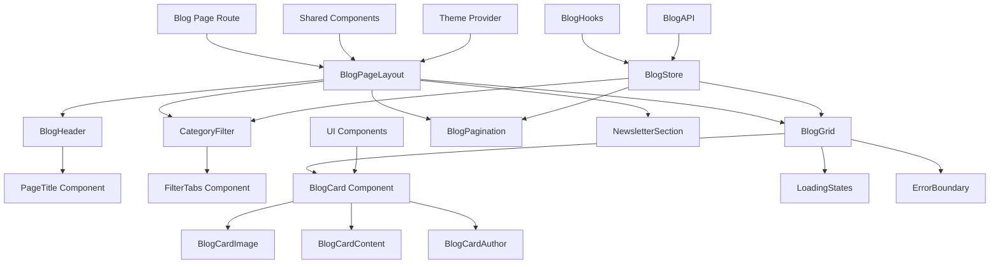

# Design Document - Blog Page UI

## Overview

博客页面UI设计文档定义了WebVault平台博客模块的完整前端架构和组件设计。该页面基于设计图 `design/11_Blog_list.png` 实现，为用户提供博客文章浏览、分类筛选和分页导航的完整体验。

本设计遵循项目的Feature First Architecture模式，充分复用现有组件和架构模式，确保与平台整体风格的一致性和代码的可维护性。

## Steering Document Alignment

### Technical Standards (tech.md)

**技术栈遵循**：
- **Next.js 15 App Router**：使用 `src/app/(public)/blog/page.tsx` 实现路由
- **shadcn/ui设计系统**：复用Button、Card、Input等基础组件
- **Zustand状态管理**：基于 `collection-store.ts` 模式创建 `blog-store.ts`
- **TypeScript严格模式**：确保类型安全和代码质量
- **Tailwind CSS + CVA**：实现响应式设计和组件变体管理

**架构标准对齐**：
- **依赖注入模式**：使用抽象接口而非单例实现
- **组合胜过继承**：基于现有组件组合构建新功能
- **显式胜过隐式**：明确的数据流和状态管理
- **测试优先思维**：为所有新组件提供测试覆盖

### Project Structure (structure.md)

**功能模块化遵循**：
```
src/features/blog/
├── components/          # 博客专用组件
├── hooks/              # 博客相关Hooks
├── stores/             # 博客状态管理  
├── types/              # 博客类型定义
└── services/           # 博客业务服务
```

**组件组织对齐**：
- 复用 `src/components/ui/` 基础组件
- 扩展 `src/features/shared/` 共享功能
- 遵循现有的错误边界和加载状态模式

## Code Reuse Analysis

### Existing Components to Leverage

**1. 卡片组件复用**
- **CollectionCard.tsx**: 作为BlogCard的设计参考
  - 复用圆角卡片容器样式 (`border-radius: 12px`)
  - 复用悬停效果 (`transform: translateY(-4px)`)
  - 复用可访问性标准 (focus-visible, aria-labels)
  - 复用响应式网格布局模式

**2. 分页组件复用**
- **Pagination.tsx**: 直接复用分页逻辑和样式
  - 复用页码数字样式 (`40px × 40px` 圆形按钮)
  - 复用左右箭头导航逻辑
  - 复用禁用状态处理

**3. Newsletter组件复用**
- **NewsletterSection.tsx**: 直接复用订阅功能
  - 复用完整的表单验证逻辑
  - 复用反机器人保护机制
  - 复用成功/错误状态处理
  - 复用隐私政策确认流程

**4. 状态管理模式复用**
- **collection-store.ts**: 作为blog-store.ts的模板
  - 复用Zustand + nuqs的URL状态同步模式
  - 复用分页状态管理逻辑
  - 复用加载和错误状态处理
  - 复用搜索参数解析器配置

### Integration Points

**1. 现有布局系统集成**
- **HeaderNavigation.tsx**: 博客导航链接已存在
- **Footer.tsx**: 博客链接已配置
- **根布局**: 复用 `src/app/layout.tsx` 的主题和提供者

**2. 设计系统集成**
- **shadcn/ui组件**: Button、Card、Input、Badge等
- **配色系统**: 复用现有的主题色彩变量
- **间距系统**: 遵循现有的布局间距标准

**3. 数据层集成**
- **API结构**: 扩展现有的 `/api/` 路由模式
- **类型定义**: 基于Website类型创建Blog类型
- **验证模式**: 复用Zod验证架构

## Architecture



## Components and Interfaces

### Component 1: BlogCard
- **Purpose**: 展示单篇博客文章的核心信息卡片
- **Interfaces**: 
  ```typescript
  interface BlogCardProps {
    blog: BlogCardData;
    className?: string;
    onTagClick?: (tag: string) => void;
    onAuthorClick?: (authorId: string) => void;
  }
  ```
- **Dependencies**: Card, Image (Next.js), Badge组件
- **Reuses**: CollectionCard的悬停效果和无障碍性设计

### Component 2: CategoryFilter
- **Purpose**: 博客分类筛选标签栏组件（静态6个分类）
- **Interfaces**:
  ```typescript
  interface CategoryFilterProps {
    activeCategory: BlogCategoryType;
    onCategoryChange: (category: BlogCategoryType) => void;
    className?: string;
  }
  ```
- **Dependencies**: Badge组件，静态分类常量
- **Reuses**: FilterTabs的交互逻辑和样式模式

### Component 3: BlogGrid
- **Purpose**: 响应式博客文章网格布局容器
- **Interfaces**:
  ```typescript
  interface BlogGridProps {
    blogs: BlogCardData[];
    loading?: boolean;
    error?: string;
    emptyState?: React.ReactNode;
  }
  ```
- **Dependencies**: BlogCard、LoadingStates、ErrorBoundary
- **Reuses**: CollectionGrid的响应式布局和加载状态

### Component 4: BlogPageLayout
- **Purpose**: 博客页面的整体布局组件
- **Interfaces**:
  ```typescript
  interface BlogPageLayoutProps {
    children: React.ReactNode;
    headerProps?: BlogHeaderProps;
    filterProps?: CategoryFilterProps;
  }
  ```
- **Dependencies**: 所有子组件
- **Reuses**: 现有页面布局的间距和容器模式

## Data Models

### BlogCardData Model
```typescript
// 简化的博客卡片数据模型，严格按照需求设计
interface BlogCardData {
  id: string;
  title: string;
  excerpt: string;
  slug: string;
  coverImage: string; // 简化为字符串URL
  author: {
    name: string;
    avatar?: string;
  };
  category: string; // 简化为字符串，使用预定义分类
  publishedAt: string; // 用于计算相对时间（如 "20d AHEAD"）
}
```

### Blog Categories (Static)
```typescript
// 预定义的6个分类，严格按照需求规格
const BLOG_CATEGORIES = [
  'All',
  'Lifestyle', 
  'Technologies',
  'Design',
  'Travel',
  'Growth'
] as const;

type BlogCategoryType = typeof BLOG_CATEGORIES[number];
```

### BlogPageState Model
```typescript
// 简化的博客页面状态，移除不必要的搜索功能
interface BlogPageState {
  // 数据状态
  blogs: BlogCardData[];
  totalCount: number;
  
  // 筛选状态
  activeCategory: BlogCategoryType;
  
  // 分页状态
  currentPage: number;
  itemsPerPage: 6; // 固定为6篇文章
  totalPages: number;
  
  // UI状态
  loading: boolean;
  error: string | null;
  
  // 操作方法
  setActiveCategory: (category: BlogCategoryType) => void;
  setCurrentPage: (page: number) => void;
  fetchBlogs: () => Promise<void>;
}
```

## Error Handling

### Error Scenarios

1. **API请求失败**
   - **Handling**: 使用ErrorBoundary捕获，显示重试按钮
   - **User Impact**: 用户看到友好的错误消息和重试选项

2. **图片加载失败**
   - **Handling**: onError回调显示默认占位图
   - **User Impact**: 显示默认博客封面图片，不影响用户体验

3. **网络连接问题**
   - **Handling**: 检测网络状态，显示离线提示
   - **User Impact**: 提示网络问题，建议检查连接

4. **空数据状态**
   - **Handling**: 显示自定义空状态组件
   - **User Impact**: 看到友好的"暂无文章"提示

5. **分页越界**
   - **Handling**: 自动重定向到有效页面
   - **User Impact**: 平滑导航到正确页面

## Testing Strategy

### Unit Testing
- **BlogCard组件**: 测试渲染、点击事件、无障碍性
- **CategoryFilter组件**: 测试分类切换、URL同步
- **BlogStore**: 测试状态管理、API调用、错误处理
- **自定义Hooks**: 测试数据获取、状态更新逻辑

### Integration Testing  
- **页面导航流程**: 测试从导航到博客页面的完整流程
- **筛选和分页**: 测试分类筛选和分页导航的联动
- **Newsletter集成**: 测试订阅功能在博客页面的集成
- **响应式布局**: 测试不同屏幕尺寸的布局适配

### End-to-End Testing
- **用户浏览文章**: 从首页导航到博客，浏览文章列表
- **分类筛选场景**: 选择分类，验证文章筛选结果
- **分页导航场景**: 测试分页导航的完整用户路径
- **订阅流程**: 测试Newsletter订阅的完整用户体验

## Performance Optimizations

### Image Optimization
- 使用 Next.js Image 组件进行自动优化
- 实现图片懒加载，视窗底部200px触发
- 支持WebP格式和响应式图片尺寸
- 配置图片占位符避免布局跳动

### Component Optimization
- 使用 React.memo 优化BlogCard重复渲染
- 使用 useCallback 和 useMemo 优化事件处理
- 代码分割实现组件级别的懒加载
- 注：6篇文章的数据量不需要虚拟化滚动

### State Management Optimization
- 使用 Zustand 的 subscribeWithSelector 优化re-render
- URL状态同步使用nuqs优化历史记录
- 使用 SWR 或 React Query 实现数据缓存和同步
- 注：移除搜索功能，专注于分类筛选优化

### API Optimization
- 实现API响应缓存和数据预取
- 使用分页和字段选择减少数据传输
- 配置请求超时和重试机制
- 实现乐观更新提升用户体验

## Security Considerations

### Input Validation
- 使用 Zod 验证所有API输入参数
- 实施XSS防护过滤用户输入内容
- 验证图片URL和文件类型安全性
- 限制搜索查询长度和特殊字符

### Content Security
- 实现内容安全策略(CSP)头部配置
- 过滤和净化博客内容中的恶意脚本
- 验证作者信息和外部链接安全性
- 实施CSRF保护和安全headers

### Performance Security
- 实现API速率限制防止滥用
- 配置图片加载速率限制
- 监控异常请求模式和错误率
- 实现用户行为分析和异常检测

## Implementation Guidelines

遵循"小步快跑"和"渐进式改进"的开发理念，分为2个简化阶段：

### Phase 1: MVP基础实现
1. 创建简化的博客类型定义（BlogCardData + 静态分类）
2. 实现BlogCard组件（复用CollectionCard模式）
3. 实现CategoryFilter组件（6个静态分类标签）
4. 创建BlogGrid响应式布局（复用现有网格模式）
5. 集成现有的Pagination组件
6. 创建简化的blog-store.ts（基于collection-store.ts模式）

### Phase 2: 集成和优化
1. 集成现有的NewsletterSection组件
2. 添加基础的加载状态和错误处理（复用现有模式）
3. 实现图片懒加载（使用Next.js Image组件）
4. 添加必要的单元测试
5. 响应式布局调优和无障碍性检查

## Accessibility Requirements

### WCAG 2.1 AA Compliance
- 所有交互元素支持键盘导航
- 实现合适的颜色对比度(最低4.5:1)
- 提供替代文本和aria标签
- 支持屏幕阅读器和辅助技术

### Keyboard Navigation
- Tab键顺序逻辑且连续
- Enter和Space键激活交互元素
- Escape键关闭模态和下拉菜单
- 箭头键导航分页和筛选选项

### Screen Reader Support
- 语义化HTML结构和landmarks
- 实时更新的aria-live区域
- 明确的表单标签和错误消息
- 图片和图标的描述性替代文本