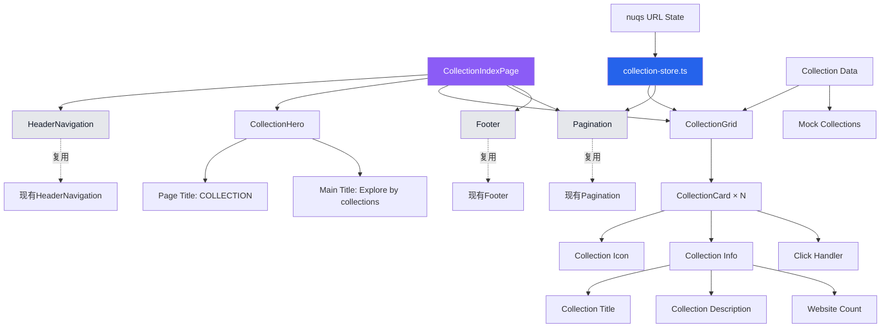

# Design - Collection Index UI

## Status
- **Phase**: Design  
- **Status**: Complete
- **Date Created**: 2025-08-15
- **Last Updated**: 2025-08-15

## Overview

基于设计图 `3_Collection_index.png` 实现WebVault集合索引页面的完整技术设计方案。该设计采用现代组件化架构，最大化复用现有的homepage-ui组件和设计系统，使用Next.js 15 + TypeScript + Tailwind CSS实现精确的视觉规范和交互功能。

## Steering Document Alignment

### Technical Standards (CLAUDE.md)
- **Next.js 15 App Router** - 使用最新的应用路由系统，支持SSR和动态渲染
- **TypeScript严格模式** - 确保类型安全和代码质量  
- **Tailwind CSS + shadcn/ui** - 复用现有的HSL主题系统和精确配色实现
- **Feature-First架构** - 按功能模块组织，在 `src/features/websites/` 下扩展
- **当前技术栈**: Zustand v5.0.7, React Hook Form v7.62.0, Zod v4.0.17, Nuqs v2.4.3, Lucide React v0.539.0
- **UI组件**: @radix-ui/react-select v2.2.6, @radix-ui/react-collapsible v1.1.12
- **响应式设计** - 支持桌面/平板/移动端适配

### Project Structure (CLAUDE.md)  
- **组件放置**: `src/features/websites/components/` - 复用现有目录结构
- **类型定义**: `src/features/websites/types/` - 扩展现有类型系统
- **状态管理**: 复用 `src/features/websites/stores/homepage-store.ts` 模式
- **页面路由**: 新建 `src/app/(public)/collection/page.tsx`

## Code Reuse Analysis

### Existing Components to Leverage
- **HeaderNavigation**: 完全复用，支持"Collection"导航高亮
- **Footer**: 完全复用，保持品牌一致性
- **Pagination**: 完全复用现有分页组件，支持URL状态同步
- **WebsiteCard样式模式**: 适配为CollectionCard组件
- **LoadingStates**: 复用骨架屏和加载指示器
- **ErrorBoundary**: 复用错误边界处理

### State Management Pattern Reuse
- **homepage-store.ts模式**: 创建类似的collection-store.ts
- **Zustand + nuqs**: 复用URL状态同步和分页状态管理
- **Filter系统**: 如需筛选功能，可复用现有FilterState模式

### Integration Points  
- **路由系统**: 与 `src/app/(public)/` 目录结构集成
- **设计系统**: 完全复用HSL主题色彩和间距系统
- **类型系统**: 扩展现有的 `src/features/websites/types/`
- **组件导出**: 更新 `src/features/websites/components/index.ts`

## Architecture

基于现有组件架构的扩展设计，确保一致性和可维护性。



## Components and Interfaces

### CollectionIndexPage (主页面组件)
- **Purpose:** 集合索引页面的根组件，统一布局和数据协调
- **Interfaces:**
```typescript
interface CollectionIndexPageProps {
  initialCollections?: Collection[];
  searchParams?: {
    page?: number;
    search?: string;
  };
}
```
- **Dependencies:** HeaderNavigation, CollectionHero, CollectionGrid, Pagination, Footer
- **Reuses:** 现有页面布局模式和shadcn/ui主题系统

### CollectionHero (标题区域组件)  
- **Purpose:** 页面标题和说明区域展示
- **Interfaces:**
```typescript
interface CollectionHeroProps {
  title?: string;
  subtitle?: string;
  className?: string;
}
```
- **Dependencies:** Typography组件
- **Reuses:** homepage-ui的标题样式和间距系统

### CollectionGrid (集合网格组件)
- **Purpose:** 响应式集合卡片网格布局容器
- **Interfaces:**
```typescript
interface CollectionGridProps {
  collections: Collection[];
  loading?: boolean;
  onCollectionClick?: (collection: Collection) => void;
  className?: string;
}
```
- **Dependencies:** CollectionCard组件
- **Reuses:** WebsiteGrid的响应式布局模式

### CollectionCard (集合卡片组件)
- **Purpose:** 单个集合信息展示卡片
- **Interfaces:**
```typescript
interface CollectionCardProps {
  collection: Collection;
  onVisit: (collection: Collection) => void;
  className?: string;
}
```
- **Dependencies:** 无，自包含组件
- **Reuses:** WebsiteCard的样式模式和交互效果

## Data Models

### Collection (集合数据模型)
```typescript
interface Collection {
  /** 唯一集合标识符 */
  id: string;
  
  /** 集合名称/标题 */
  title: string;
  
  /** 集合描述 */
  description: string;
  
  /** 集合图标配置 */
  icon: {
    /** 图标字符（emoji或字母） */
    character: string;
    /** 图标背景色（主题色） */
    backgroundColor: string;
    /** 图标文字颜色 */
    textColor: string;
  };
  
  /** 集合包含的网站数量 */
  websiteCount: number;
  
  /** 集合创建时间 */
  createdAt: string;
  
  /** 集合更新时间 */
  updatedAt: string;
  
  /** 集合状态 */
  status: 'active' | 'inactive' | 'draft';
  
  /** 集合标签 */
  tags?: string[];
  
  /** 排序权重（用于展示顺序） */
  sortOrder?: number;
  
  /** 集合创建者ID */
  createdBy?: string;
  
  /** SEO相关字段 */
  slug?: string;
  metaDescription?: string;
}
```

### CollectionState (集合页面状态模型)  
```typescript
interface CollectionState {
  /** 当前集合列表 */
  collections: Collection[];
  
  /** 加载状态 */
  loading: boolean;
  
  /** 错误信息 */
  error: string | null;
  
  /** 分页信息 */
  pagination: {
    currentPage: number;
    totalPages: number;
    totalItems: number;
    itemsPerPage: number;
  };
  
  /** 搜索查询 */
  searchQuery?: string;
  
  /** 筛选条件 */
  filters?: {
    status?: string[];
    tags?: string[];
  };
}
```

## State Management Design

### CollectionStore (基于homepage-store模式)
```typescript
// src/features/websites/stores/collection-store.ts
interface CollectionStore {
  // 状态
  collections: Collection[];
  loading: boolean;
  error: string | null;
  currentPage: number;
  totalPages: number;
  
  // Actions
  loadCollections: (page?: number) => Promise<void>;
  setCurrentPage: (page: number) => void;
  setSearchQuery: (query: string) => void;
  clearError: () => void;
  
  // URL同步Actions
  syncWithURL: () => void;
  updateURL: (params: Partial<CollectionSearchParams>) => void;
}
```

### URL状态同步 (基于nuqs)
```typescript
// 复用homepage-store的nuqs模式
export const collectionSearchParams = {
  page: parseAsInteger.withDefault(1),
  search: parseAsString.withDefault(''),
  // 可扩展其他参数
};

export function useCollectionUrlState() {
  return useQueryStates(collectionSearchParams);
}
```

## Routing and Page Structure

### 页面路由实现
```typescript
// src/app/(public)/collection/page.tsx
import { Metadata } from 'next';
import dynamic from 'next/dynamic';

const CollectionIndexPage = dynamic(
  () => import('@/features/websites/components').then(mod => ({ 
    default: mod.CollectionIndexPage 
  })),
  {
    loading: () => <CollectionLoadingSkeleton />
  }
);

export const metadata: Metadata = {
  title: 'WebVault - 集合',
  description: '探索精选的网站主题集合，发现高质量的网站资源',
};

export default function CollectionRoute() {
  return <CollectionIndexPage />;
}
```

### 动态元数据支持
```typescript
export async function generateMetadata({ 
  searchParams 
}: { 
  searchParams: Promise<{ [key: string]: string | string[] | undefined }> 
}): Promise<Metadata> {
  const params = await searchParams;
  const search = params.search as string;
  
  return {
    title: search 
      ? `搜索集合：${search} - WebVault` 
      : 'WebVault - 集合',
    description: search 
      ? `搜索包含"${search}"的网站集合`
      : '探索精选的网站主题集合，发现高质量的网站资源',
  };
}
```

## Performance Optimization

### 图片和图标优化
- 集合图标使用CSS背景色 + 文字/emoji，避免图片加载
- 支持高分辨率显示的矢量图标
- 图标颜色使用设计系统预定义的主题色

### 数据获取策略  
- 首屏数据SSR预渲染（6-9个集合）
- 分页数据客户端异步加载
- 集合数据本地缓存和状态持久化

### 交互优化
- 卡片悬停效果使用CSS transforms避免重排
- 分页切换使用乐观UI更新
- 加载状态使用骨架屏提升感知性能

### 代码分割
- 页面组件动态导入
- 非关键功能延迟加载
- Bundle分析优化

## Error Handling

### Error Scenarios
1. **集合数据加载失败**
   - **Handling:** 显示错误提示和重试按钮，保持页面基本框架
   - **User Impact:** 用户可以重试或访问其他页面功能

2. **分页请求失败**  
   - **Handling:** 回退到上一个成功状态，显示临时错误提示
   - **User Impact:** 分页状态恢复，用户可以重新尝试

3. **路由参数错误**
   - **Handling:** 重定向到默认第一页，清理无效URL参数
   - **User Impact:** 自动修正URL，用户无感知修复

### Error Boundary Integration
```typescript
// 复用现有ErrorBoundary
<ErrorBoundary
  fallback={<CollectionErrorFallback />}
  onError={(error) => console.error('Collection page error:', error)}
>
  <CollectionIndexPage />
</ErrorBoundary>
```

## Responsive Design

### 桌面端 (>1024px)
- 3列集合卡片网格，列间距24px
- 卡片尺寸: 约300px宽，自适应高度
- 每页显示9个集合（3×3网格）

### 平板端 (768px - 1024px)
- 2列集合卡片网格，保持24px间距
- 卡片宽度自适应容器
- 每页显示8个集合（4×2网格）

### 移动端 (<768px)  
- 1列集合卡片布局，垂直排列
- 卡片横向填满容器，保持16px边距
- 每页显示6个集合，支持无限滚动优化

## Integration Strategy

### HeaderNavigation集成
```typescript
// 确保"Collection"导航项高亮
const navigationItems = [
  { label: "Home", href: "/" },
  { label: "Search", href: "/search" },
  { label: "Collection", href: "/collection", active: true }, // 当前页面
  // ... 其他导航项
];
```

### Footer复用
- 完全复用现有Footer组件
- 保持品牌一致性和链接结构

### Pagination集成
```typescript
// 复用现有Pagination组件
<Pagination
  currentPage={currentPage}
  totalPages={totalPages}
  onPageChange={handlePageChange}
  // 复用现有样式和交互逻辑
/>
```

## Testing Strategy

### Unit Testing
- CollectionCard组件的props渲染测试
- CollectionGrid响应式布局测试  
- CollectionStore状态管理逻辑测试

### Integration Testing  
- 分页功能与URL同步的集成测试
- 集合数据加载和错误处理测试
- 响应式布局在不同断点的测试

### End-to-End Testing
- 用户浏览集合→点击分页→访问集合详情的完整流程
- 移动端和桌面端的交互体验测试
- 网络异常情况下的用户体验测试

## Implementation Plan

### Phase 1: 基础设置 (1天)
1. 创建Collection类型定义
2. 创建collection-store状态管理
3. 添加Mock集合数据
4. 创建页面路由结构

### Phase 2: 核心组件 (2天)  
1. 实现CollectionCard组件
2. 实现CollectionGrid网格布局
3. 实现CollectionHero标题区域
4. 集成响应式设计

### Phase 3: 页面整合 (1天)
1. 实现CollectionIndexPage主组件
2. 集成HeaderNavigation和Footer
3. 添加Pagination分页功能
4. 完成路由页面集成

### Phase 4: 优化增强 (1天)
1. 添加加载状态和错误处理
2. 性能优化和交互动效
3. 无障碍访问和SEO优化
4. 测试用例编写

## Design System Integration

### Color System (复用homepage-ui)
```css
/* 完全复用现有HSL主题色彩 */
--background: 220 13% 98%;        /* #F9FAFB */
--card: 0 0% 100%;                /* #FFFFFF */  
--primary: 262 83% 58%;           /* #8B5CF6 */
--secondary: 217 91% 60%;         /* #2563EB */
--muted-foreground: 220 9% 43%;   /* #6B7281 */
--border: 220 13% 91%;            /* #E5E7EB */
```

### Typography Scale
```css
/* 复用现有字体层次 */
.collection-title {      /* 集合卡片标题 */
  font-size: 20px;
  font-weight: 600;
  line-height: 1.3;
}

.collection-description { /* 集合描述 */
  font-size: 14px;
  font-weight: 400;
  line-height: 1.5;
}

.page-title {            /* 页面主标题 */
  font-size: 48px;
  font-weight: 800;
  line-height: 1.2;
}
```

### Spacing System (8pt Grid)
```css
/* 复用现有间距系统 */
--card-padding: 16px;
--card-gap: 24px;
--section-gap: 40px;
--container-padding: 24px;
```

## Technical Constraints

### Browser Support
- 现代浏览器（Chrome 90+, Firefox 88+, Safari 14+, Edge 90+）
- 移动端浏览器（iOS Safari, Android Chrome）
- 支持CSS Grid和Flexbox

### Performance Requirements
- 首屏渲染时间 < 2秒
- 分页切换响应时间 < 500ms
- 图标渲染无加载延迟
- 支持PWA离线缓存

### Accessibility Requirements
- WCAG 2.1 AA级别符合性
- 键盘导航支持
- 屏幕阅读器兼容
- 高对比度模式支持