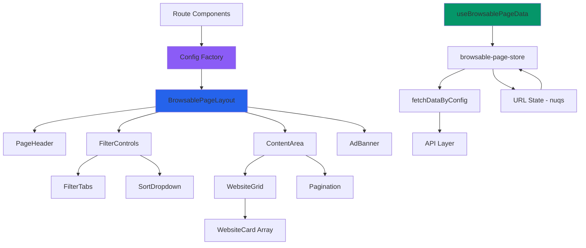

# Design - 过滤浏览页面UI

## Status
- **Phase**: Design
- **Status**: Complete  
- **Date Created**: 2025-08-15
- **Last Updated**: 2025-08-15

## Overview

基于requirements.md中定义的需求，为WebVault的三个核心浏览页面设计统一的技术架构。通过配置驱动的BrowsablePageLayout组件和BrowsablePageConfig接口实现90%+的代码复用率，打造高效、可维护的浏览体验。

整体设计采用配置化架构模式，通过统一的布局组件根据配置动态渲染不同页面类型，最大化组件复用并保持用户体验的一致性。

## Steering Document Alignment

### Technical Standards (tech.md)
- **Next.js 15 App Router** - 采用SSR/CSR混合策略：集合页面使用SSR优化SEO，分类/标签页面使用CSR支持动态筛选
- **TypeScript严格模式** - 所有组件和Hook使用完整的TypeScript类型约束，BrowsablePageConfig核心配置接口类型安全  
- **Tailwind CSS + shadcn/ui** - 复用homepage-ui建立的HSL配色系统和组件设计语言
- **Feature-First架构** - 采用browsable-pages统一功能模块管理三个页面的所有组件
- **状态管理**: Zustand v5.0.7 + Nuqs v2.4.3 实现本地状态和URL状态同步
- **表单验证**: React Hook Form v7.62.0 + Zod v4.0.17 用于筛选参数验证

### Project Structure (structure.md)
- **功能模块**: `src/features/browsable-pages/` - 统一管理三个浏览页面功能模块
- **组件复用**: `src/features/websites/components/` - 复用WebsiteGrid、WebsiteCard、Pagination
- **状态管理**: `src/features/browsable-pages/stores/browsable-page-store.ts` - 统一页面状态
- **路由结构**: 
  - `src/app/(public)/collection/[slug]/page.tsx` - 集合详情页
  - `src/app/(public)/category/page.tsx` - 分类浏览页  
  - `src/app/(public)/tag/page.tsx` - 标签浏览页

## Code Reuse Analysis

### Existing Components to Leverage
- **WebsiteGrid** (`src/features/websites/components/WebsiteGrid.tsx`): 复用响应式卡片网格布局，支持3/2/1列自适应
- **WebsiteCard** (`src/features/websites/components/WebsiteCard.tsx`): 复用网站卡片设计，包含图标、标题、描述、标签pills、Visit Website按钮
- **Pagination** (`src/features/websites/components/Pagination.tsx`): 复用分页导航组件，集成URL状态同步功能
- **HeaderNavigation** (`src/features/websites/components/HeaderNavigation.tsx`): 复用顶部导航栏，保持品牌一致性
- **Footer** (`src/features/websites/components/Footer.tsx`): 复用页面底部组件
- **Loading States** (`src/features/websites/components/CollectionLoadingStates.tsx`): 复用加载状态组件

### Integration Points
- **路由集成**: 与现有路由系统无缝集成，支持动态参数`/collection/[slug]`等
- **状态集成**: 扩展homepage-ui建立的状态管理模式，保持架构一致性
- **API集成**: 复用现有的`/api/collections/`和`/api/websites/`端点
- **样式集成**: 复用homepage-ui的HSL配色方案、字体系统、响应式布局
- **类型集成**: 扩展现有的`Website`、`Category`、`Collection`类型定义

### Extension Points
- **数据服务**: 扩展`src/features/websites/stores/collection-store.ts`的数据获取逻辑
- **筛选逻辑**: 扩展现有的筛选Hooks，支持多维度筛选
- **URL管理**: 集成nuqs扩展现有的URL参数管理

## Architecture

所有页面通过统一的BrowsablePageConfig配置接口驱动页面渲染逻辑



## Components and Interfaces

### BrowsablePageLayout (统一页面布局组件)
- **Purpose:** 所有页面的统一布局容器，根据配置动态渲染不同页面类型
- **Interfaces:**
```typescript
interface BrowsablePageLayoutProps {
  config: BrowsablePageConfig;
  children?: React.ReactNode;
  className?: string;
}

interface BrowsablePageConfig {
  pageType: 'collection' | 'category' | 'tag';
  title: string;
  subtitle?: string;
  apiEndpoint: string;
  filterType?: 'category' | 'tag' | 'none';
  filterOptions?: FilterOption[];
  showAdBanner?: boolean;
  enableSorting?: boolean;
  enablePagination?: boolean;
  seoTitle?: string;
  seoDescription?: string;
}
```
- **Dependencies:** PageHeader, FilterControls, WebsiteGrid, AdBanner, Pagination
- **Reuses:** 现有的响应式布局和样式系统

### ConfigFactory (配置工厂函数)
- **Purpose:** 根据页面类型生成配置对象
- **Interfaces:**
```typescript
interface ConfigFactoryMethods {
  createCollectionPageConfig: (collection: CollectionData) => BrowsablePageConfig;
  createCategoryPageConfig: () => BrowsablePageConfig;
  createTagPageConfig: () => BrowsablePageConfig;
}
```
- **Dependencies:** 集合、分类、标签的基础数据
- **Reuses:** 现有的数据类型定义和API接口设计

### PageHeader (页面标题组件)
- **Purpose:** 根据配置动态显示页面标识和标题
- **Interfaces:**
```typescript
interface PageHeaderProps {
  pageType: 'COLLECTION' | 'CATEGORY' | 'TAG';
  title: string;
  subtitle?: string;
  breadcrumbs?: BreadcrumbItem[];
  className?: string;
}
```
- **Dependencies:** 无外部依赖
- **Reuses:** homepage-ui的标题样式规范

### FilterControls (筛选控件容器)
- **Purpose:** 条件性渲染筛选标签栏和排序下拉菜单
- **Interfaces:**
```typescript
interface FilterControlsProps {
  filterType: 'category' | 'tag' | 'none';
  filterOptions?: FilterOption[];
  activeFilters: Record<string, any>;
  sortBy: SortField;
  enableSorting: boolean;
  onFilterChange: (key: string, value: any) => void;
  onSortChange: (sortBy: SortField) => void;
}
```
- **Dependencies:** FilterTabs, SortDropdown
- **Reuses:** 现有的筛选逻辑和UI组件

### FilterTabs (筛选标签组件)
- **Purpose:** 显示分类筛选标签或标签筛选选项
- **Interfaces:**
```typescript
interface FilterTabsProps {
  options: FilterOption[];
  activeValue: string;
  onValueChange: (value: string) => void;
  className?: string;
}

interface FilterOption {
  value: string;
  label: string;
  count?: number;
}
```
- **Dependencies:** shadcn/ui Button组件
- **Reuses:** homepage-ui的样式系统和交互模式

### SortDropdown (排序下拉组件)
- **Purpose:** 提供时间、名称、访问量等排序选项
- **Interfaces:**
```typescript
interface SortDropdownProps {
  options: SortOption[];
  value: SortField;
  onValueChange: (value: SortField) => void;
  className?: string;
}

interface SortOption {
  value: SortField;
  label: string;
}

type SortField = 'time_listed' | 'name' | 'visit_count' | 'rating';
```
- **Dependencies:** @radix-ui/react-select
- **Reuses:** 现有的下拉菜单样式

### useBrowsablePageData (统一数据获取Hook)
- **Purpose:** 所有页面的统一数据获取和状态管理Hook
- **Interfaces:**
```typescript
interface BrowsablePageDataHook {
  websites: WebsiteCardData[];
  loading: boolean;
  error: string | null;
  pagination: {
    currentPage: number;
    totalPages: number;
    totalItems: number;
  };
  actions: {
    updateFilters: (filters: Record<string, any>) => void;
    updateSort: (sortBy: SortField) => void;
    setPage: (page: number) => void;
    reset: () => void;
  };
  collectionData?: CollectionData;
}

function useBrowsablePageData(
  config: BrowsablePageConfig,
  filters?: FilterParams
): BrowsablePageDataHook;
```
- **Dependencies:** browsable-page-store, fetchDataByConfig服务
- **Reuses:** 现有的数据获取模式和缓存策略

## Data Models

### BrowsablePageData (统一页面数据模型)
```typescript
interface BrowsablePageData {
  websites: WebsiteCardData[];
  pagination: PaginationInfo;
  filters?: {
    categories?: CategoryOption[];
    tags?: TagOption[];
    availableSorts: SortOption[];
  };
  collectionData?: CollectionData; // 仅集合页面使用
}
```

### FilterParams (筛选参数模型)
```typescript
interface FilterParams {
  category?: string;
  tags?: string[];
  sort?: SortField;
  page?: number;
  search?: string;
}
```

### BrowsablePageState (页面状态模型)
```typescript
interface BrowsablePageState {
  // 配置
  config: BrowsablePageConfig | null;
  
  // 数据
  websites: WebsiteCardData[];
  loading: boolean;
  error: string | null;
  
  // 筛选
  activeFilters: Record<string, any>;
  sortBy: SortField;
  
  // 分页
  currentPage: number;
  totalPages: number;
  totalItems: number;
  
  // 集合特有数据
  collectionData?: CollectionData;
  
  // Actions
  setConfig: (config: BrowsablePageConfig) => void;
  loadData: (params?: FilterParams) => Promise<void>;
  updateFilters: (filters: Record<string, any>) => void;
  updateSort: (sortBy: SortField) => void;
  setPage: (page: number) => void;
  reset: () => void;
  loadCollectionData: (slug: string) => Promise<void>;
}
```

### WebsiteCardData (扩展现有网站卡片数据)
```typescript
// 扩展现有Website类型定义
interface WebsiteCardData extends Website {
  // 卡片展示必需的字段
  id: string;
  title: string;
  description: string;
  url: string;
  iconUrl?: string;
  tags: TagData[];
  categoryName?: string;
  isAd?: boolean;
  adType?: 'sponsored' | 'featured' | 'premium';
}
```

## Error Handling

### Error Scenarios
1. **配置对象错误**
   - **Handling:** 使用Zod验证配置对象完整性，提供默认配置
   - **User Impact:** 显示错误页面或回退到默认配置

2. **API数据获取失败**  
   - **Handling:** 显示友好错误提示，提供重试按钮，记录错误到日志系统
   - **User Impact:** 加载状态变为"数据加载失败，请重试"可点击重新获取

3. **筛选参数无效**
   - **Handling:** URL参数验证失败时回退到默认状态，使用Zod验证筛选参数
   - **User Impact:** 筛选选项自动重置为默认页面状态

4. **分页参数超范围**
   - **Handling:** 分页数字无效时重定向到第1页
   - **User Impact:** 自动跳转到有效页码并显示提示信息

## Testing Strategy

### Unit Testing
- **配置工厂测试**: 验证各种输入下BrowsablePageConfig生成正确性
- **组件渲染测试**: 测试BrowsablePageLayout根据配置对象正确渲染
- **Hook逻辑测试**: 测试useBrowsablePageData的数据获取和状态管理逻辑
- **筛选逻辑测试**: 验证FilterTabs和SortDropdown的交互逻辑

### Integration Testing
- **配置驱动渲染测试**: 验证配置对象能够驱动页面渲染
- **URL状态同步测试**: 测试筛选操作与URL参数的同步
- **API数据获取测试**: 验证fetchDataByConfig根据配置正确调用API
- **组件交互测试**: 测试筛选选择、排序切换、分页导航的完整交互

### End-to-End Testing
- **页面导航测试**: 测试三个浏览页面的完整导航流程
- **筛选功能测试**: 验证筛选条件应用、页面切换、状态保持等核心功能
- **响应式测试**: 在不同设备尺寸下测试页面布局和交互
- **性能测试**: 测试大数据量下的加载性能和用户体验