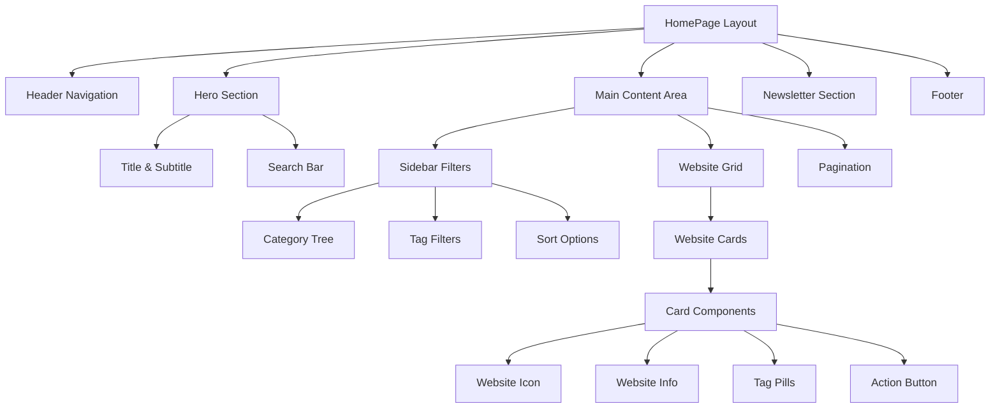

# Design - Homepage UI

## Status
- **Phase**: Design  
- **Status**: Complete
- **Date Created**: 2025-08-14
- **Last Updated**: 2025-08-14

## Overview

基于设计图 `1_homepage.png` 实现WebVault首页的完整技术设计方案。该设计采用现代响应式布局，使用Next.js 15 + Tailwind CSS实现精确的视觉规范，支持完整的搜索、筛选和网站展示功能。

## Steering Document Alignment

### Technical Standards (tech.md)
- **Next.js 15 App Router** - 使用最新的应用路由系统
- **TypeScript严格模式** - 确保类型安全和代码质量  
- **Tailwind CSS + shadcn/ui** - 基于HSL主题系统的精确配色实现
- **Feature-First架构** - 按功能模块组织组件和逻辑
- **当前技术栈**: Zustand v5.0.7, React Hook Form v7.62.0, Zod v4.0.17, Nuqs v2.4.3, Lucide React v0.539.0
- **UI组件**: @radix-ui/react-select v2.2.6, @radix-ui/react-collapsible v1.1.12
- **响应式设计** - 支持桌面/平板/移动端适配

### Project Structure (structure.md)  
- **组件放置**: `src/features/websites/components/`
- **Hooks管理**: `src/features/websites/hooks/`  
- **类型定义**: `src/features/websites/types/`
- **状态管理**: `src/stores/` 和功能内状态
- **页面路由**: `src/app/(public)/page.tsx` 重构

## Code Reuse Analysis

### Existing Components to Leverage
- **Layout组件**: `src/components/layout/` - 可复用页面框架和导航
- **UI基础组件**: `src/components/ui/` - Button, Input, Card等shadcn组件
- **主题系统**: Tailwind配置已支持暗色模式和设计tokens
- **字体系统**: Inter字体已在 `src/app/layout.tsx` 中配置

### Integration Points  
- **路由系统**: 与 `src/app/(public)/search/` 和 `src/app/(public)/category/` 集成
- **状态管理**: 利用 `src/stores/` 中的URL状态同步和主题管理
- **API集成**: 预留与 `src/app/api/websites/` 的数据接口
- **认证系统**: 与 `src/lib/auth/` 的登录状态集成

## Design System Specification

### shadcn/ui HSL主题系统集成
```css
/* 精确配色与shadcn/ui主题系统整合 - 已更新到 src/app/globals.css */
:root {
  /* WebVault 精确配色系统 - 基于设计图 1_homepage.png */
  --background: 220 13% 98%;        /* #F9FAFB - 页面主背景 */
  --foreground: 220 23% 6%;         /* #111827 - 主标题文本 */
  --card: 0 0% 100%;                /* #FFFFFF - 卡片背景 */
  --card-foreground: 220 13% 23%;   /* #374151 - 正文文本 */
  
  /* 主要强调色 - 紫色系 */
  --primary: 262 83% 58%;           /* #8B5CF6 - 主要按钮、高亮选项 */
  --primary-foreground: 0 0% 100%;  /* #FFFFFF - 按钮文字 */
  
  /* 次要强调色 - 蓝色系 */
  --secondary: 217 91% 60%;         /* #2563EB - Visit Website按钮 */
  --secondary-foreground: 0 0% 100%; /* #FFFFFF */
  
  /* 中性色系 */
  --muted: 220 13% 96%;             /* #F3F4F6 - 输入框背景 */
  --muted-foreground: 220 9% 43%;   /* #6B7281 - 辅助文本 */
  
  /* 边框和输入框 */
  --border: 220 13% 91%;            /* #E5E7EB - 卡片、输入框边框 */
  --input: 220 13% 91%;             /* #E5E7EB */
  --ring: 262 83% 58%;              /* #8B5CF6 - 聚焦环 */
}

/* Tailwind 类名映射 */
.text-primary   -> text-foreground     (#111827)
.text-secondary -> text-card-foreground (#374151)  
.text-muted     -> text-muted-foreground (#6B7281)
.bg-page        -> bg-background        (#F9FAFB)
.bg-card        -> bg-card             (#FFFFFF)
.border-default -> border-border       (#E5E7EB)
```

### 间距系统 (8pt Grid)
```css
/* 基于8的倍数的间距系统 */
:root {
  --spacing-xs: 8px;
  --spacing-sm: 16px;  
  --spacing-md: 24px;   /* 卡片间距、内边距 */
  --spacing-lg: 32px;   /* 主内容与侧边栏间距 */
  --spacing-xl: 40px;   /* 标题与搜索框间距 */
  
  /* 组件尺寸 */
  --sidebar-width: 256px;
  --button-height: 44px;
  --input-height: 44px;
  --icon-size: 32px;
  --navbar-height: 72px;
}
```

### 字体系统
```css
/* 现代无衬线字体层次 */
.typography {
  --font-h1: 60px;     /* font-weight: 800 */
  --font-h3: 20px;     /* font-weight: 600 */  
  --font-body: 14px;   /* line-height: 24px */
  --font-tag: 12px;
  --font-button: 14px;
}
```

### 圆角系统
```css
/* 统一圆角规范 */
:root {
  --radius-sm: 6px;    /* 标签 */
  --radius-md: 8px;    /* 按钮、输入框 */
  --radius-lg: 16px;   /* 卡片 */
}
```

## Architecture

现代组件化架构，支持服务端渲染和客户端交互的混合模式。



## Components and Interfaces

### HomePage (主页面组件)
- **Purpose:** 统一的首页布局和数据协调
- **Interfaces:**
```typescript
interface HomePageProps {
  initialWebsites?: Website[];
  categories?: Category[];
  searchParams?: {
    search?: string;
    category?: string;
    tags?: string[];
    page?: number;
  };
}
```
- **Dependencies:** HeaderNavigation, HeroSection, WebsiteGrid, SidebarFilters, NewsletterSection, Footer
- **Reuses:** 现有的Layout组件框架和shadcn/ui主题系统

### HeaderNavigation (导航栏组件)  
- **Purpose:** 顶部导航栏，品牌展示和用户操作
- **Interfaces:**
  - 导航菜单项配置
  - 用户登录状态显示
- **Dependencies:** 认证系统集成
- **Reuses:** `src/components/layout/` 中的导航模式

### HeroSection (英雄区域组件)
- **Purpose:** 主标题、副标题和搜索功能
- **Interfaces:**
  - `onSearch: (query: string) => void`
  - 搜索建议和自动完成支持
- **Dependencies:** SearchInput, 路由导航
- **Reuses:** `src/components/ui/Input` 和 `src/components/ui/Button`

### SidebarFilters (筛选侧边栏)
- **Purpose:** 分类树、标签筛选和排序选项
- **Interfaces:**
  - `categories: Category[]`
  - `selectedFilters: FilterState`
  - `onFilterChange: (filters: FilterState) => void`
- **Dependencies:** Collapsible, Select组件
- **Reuses:** `src/components/ui/` 中的交互组件

### WebsiteGrid (网站网格组件)
- **Purpose:** 响应式网站卡片网格布局
- **Interfaces:**
  - `websites: Website[]`
  - `loading: boolean`
  - `onLoadMore?: () => void`
- **Dependencies:** WebsiteCard组件
- **Reuses:** CSS Grid和响应式断点系统

### WebsiteCard (网站卡片组件)
- **Purpose:** 单个网站信息展示卡片
- **Interfaces:**
  - `website: Website` (包含title, description, tags, icon, url等)
  - `onVisit: (url: string) => void`
- **Dependencies:** TagPill, Button组件
- **Reuses:** `src/components/ui/Card` 的基础样式

### NewsletterSection (订阅区域)
- **Purpose:** 邮箱订阅功能和社区加入引导
- **Interfaces:**  
  - `onSubscribe: (email: string) => Promise<void>`
  - 表单验证和提交状态管理
- **Dependencies:** EmailInput, 表单验证
- **Reuses:** 表单处理和验证逻辑

### Pagination (分页组件)
- **Purpose:** 多页内容导航和页码显示
- **Interfaces:**
  - `currentPage: number`
  - `totalPages: number` 
  - `onPageChange: (page: number) => void`
- **Dependencies:** 路由状态同步
- **Reuses:** URL状态管理模式

## Data Models

### Website (网站数据模型)
```typescript
interface Website {
  id: string;
  title: string;
  description: string;
  url: string;
  iconUrl?: string;
  tags: string[];
  categoryId: string;        // 引用Category.id
  subcategoryId?: string;    // 可选子分类
  isAd?: boolean;
  adType?: 'sponsored' | 'featured' | 'premium';
  status: 'active' | 'pending' | 'inactive';
  createdAt: string;
  updatedAt: string;
  visitCount?: number;
  rating?: number;
  submittedBy?: string;      // 提交者ID
  approvedBy?: string;       // 审核者ID
  // SEO和元数据字段
  metaTitle?: string;
  metaDescription?: string;
  keywords?: string[];
}
```

### Category (分类数据模型)  
```typescript  
interface Category {
  id: string;
  name: string;
  slug: string;
  parentId?: string;
  children?: Category[];
  websiteCount: number;
}
```

### FilterState (筛选状态模型)
```typescript
interface FilterState {
  categories: string[];
  tags: string[];
  sortBy: 'timeCreated' | 'visitCount' | 'title';
  sortOrder: 'asc' | 'desc';
  searchQuery?: string;
}
```

## Error Handling

### Error Scenarios
1. **网站数据加载失败**
   - **Handling:** 显示骨架屏loading状态，错误时展示重试按钮
   - **User Impact:** 友好的错误提示，不影响其他功能使用

2. **搜索请求失败**  
   - **Handling:** 客户端缓存上次结果，显示网络错误提示
   - **User Impact:** 搜索框保持可用，提供离线模式说明

3. **筛选状态同步错误**
   - **Handling:** URL状态回退到默认值，本地存储备份
   - **User Impact:** 筛选状态重置但不影响页面基本浏览

## Performance Optimization

### 图片优化
- 使用Next.js Image组件自动优化网站图标
- 懒加载卡片图片，支持WebP格式
- 提供占位符和加载状态

### 数据获取策略  
- 首屏数据SSR预渲染
- 分页数据客户端异步加载
- 筛选结果本地缓存和去重

### 交互优化
- 卡片悬停效果使用CSS transforms避免重排
- 筛选操作防抖处理减少请求频率
- 虚拟滚动支持大量网站数据展示

## Responsive Design

### 桌面端 (>1024px)
- 3列网站卡片网格，列间距24px
- 固定256px宽度侧边栏  
- 导航栏水平布局，完整功能展示

### 平板端 (768px - 1024px)
- 2列网站卡片网格，保持24px间距
- 侧边栏折叠为顶部筛选器
- 导航栏紧凑布局

### 移动端 (<768px)  
- 1列网站卡片布局，垂直排列
- 侧边栏转为底部抽屉或顶部折叠筛选
- 触摸友好的按钮尺寸(最小44px)
- 简化导航菜单为汉堡包菜单

## Testing Strategy

### Unit Testing
- 各组件的props接收和渲染测试
- 筛选逻辑和状态管理函数测试  
- 响应式布局在不同断点的展示测试

### Integration Testing  
- 搜索功能与路由导航的集成测试
- 筛选状态与URL同步的测试
- 分页与数据加载的协调测试

### End-to-End Testing
- 用户浏览网站→搜索→筛选→访问的完整流程
- 移动端和桌面端的交互体验测试
- 网络异常情况下的用户体验测试