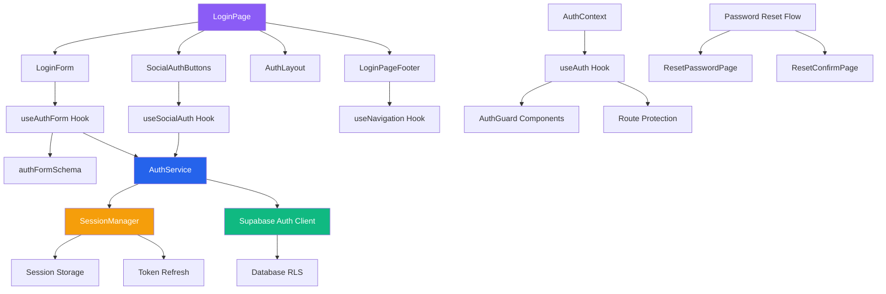
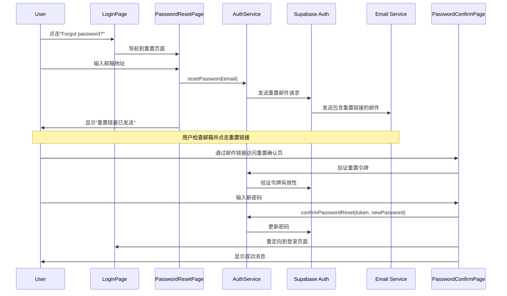
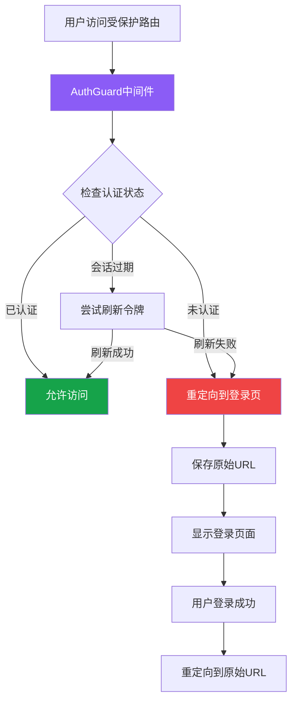

# Design - Login Page UI

## Status
- **Phase**: Design  
- **Status**: Complete
- **Date Created**: 2025-08-17
- **Last Updated**: 2025-08-17

## Overview

基于设计图 `8_Login.png` 实现WebVault登录页面的完整技术设计方案。该设计采用现代认证UI模式，使用Next.js 15 + shadcn/ui实现精确的视觉规范，支持邮箱登录、社交认证和密码恢复的完整认证流程。

## Steering Document Alignment

### Technical Standards (tech.md)
- **Next.js 15 App Router** - 使用最新的应用路由系统和Server Components
- **TypeScript严格模式** - 确保认证流程的类型安全和代码质量  
- **Tailwind CSS + shadcn/ui** - 基于HSL主题系统的精确配色实现
- **Feature-First架构** - 认证功能独立模块化，便于维护和扩展
- **当前技术栈**: Zustand v5.0.7 (状态管理), React Hook Form v7.62.0 (表单处理), Zod v4.0.17 (表单验证)
- **Supabase Auth** - 集成现有的认证服务层和数据库RLS策略
- **安全最佳实践** - HTTPS强制、CSRF防护、OAuth安全重定向

### Project Structure (structure.md)  
- **认证组件放置**: `src/features/auth/components/` (新增auth功能模块)
- **认证Hooks管理**: `src/features/auth/hooks/`  
- **认证类型定义**: `src/features/auth/types/`
- **认证状态管理**: `src/lib/auth/` 和 `src/stores/auth-store.ts`
- **页面路由**: `src/app/(auth)/login/page.tsx` (新增auth路由组)

## Code Reuse Analysis

### Existing Components to Leverage
- **UI基础组件**: `src/components/ui/` - Button, Input, Card, Label等shadcn组件
- **表单系统**: `src/features/websites/schemas/` - 复用XSS防护和验证模式
- **主题系统**: `src/app/globals.css` - 已配置的HSL主题和暗色模式支持
- **Logo组件**: `src/features/websites/components/HeaderNavigation.tsx` - 复用WebVault品牌标识
- **错误边界**: `src/features/websites/components/ErrorBoundary.tsx` - 认证错误处理

### Integration Points  
- **路由系统**: 与 `src/app/(public)/` 页面集成，支持认证保护和重定向
- **认证服务**: 预留与 `src/lib/auth/` 的Supabase Auth集成
- **状态管理**: 利用 `src/stores/` 中的主题管理和URL状态同步
- **API集成**: 与 `src/app/api/auth/` 路由处理认证回调和会话管理
- **导航集成**: 与HeaderNavigation组件的登录状态显示集成

## Architecture

认证系统采用分层架构设计，分离UI层、业务逻辑层和数据访问层：



## AuthService Interface Design

### 核心AuthService接口
```typescript
interface AuthService {
  // 邮箱密码登录
  signIn(credentials: AuthFormData): Promise<AuthSession>;
  
  // 社交登录
  signInWithProvider(
    provider: 'google' | 'github', 
    options?: { redirectTo?: string }
  ): Promise<AuthSession>;
  
  // 登出
  signOut(): Promise<void>;
  
  // 会话管理
  refreshSession(): Promise<AuthSession>;
  getSession(): Promise<AuthSession | null>;
  
  // 密码重置
  resetPassword(email: string): Promise<void>;
  confirmPasswordReset(token: string, newPassword: string): Promise<void>;
  
  // 账户锁定管理
  checkAccountLockout(email: string): Promise<{ isLocked: boolean; remainingTime?: number }>;
  recordFailedAttempt(email: string): Promise<void>;
  clearFailedAttempts(email: string): Promise<void>;
  
  // 会话验证
  validateSession(session: AuthSession): Promise<boolean>;
  
  // 用户信息
  getCurrentUser(): Promise<AuthUser | null>;
  updateUserMetadata(metadata: Partial<AuthUser['user_metadata']>): Promise<AuthUser>;
}
```

### 会话管理策略
```typescript
interface SessionManagementStrategy {
  // 令牌刷新策略 (满足requirements.md的30天持久化要求)
  tokenRefreshConfig: {
    expiryThreshold: number;    // 24小时内自动刷新
    maxRetries: number;         // 最大重试次数
    retryDelay: number;         // 重试延迟
  };
  
  // 存储策略
  storageConfig: {
    useSecureCookies: boolean;  // 生产环境使用安全Cookie
    cookieDomain: string;       // Cookie域名
    cookiePath: string;         // Cookie路径
    sameSite: 'strict' | 'lax'; // CSRF防护
  };
  
  // 锁定策略 (满足requirements.md的15分钟锁定要求)
  lockoutConfig: {
    maxAttempts: number;        // 5次失败尝试
    lockoutDuration: number;    // 15分钟锁定
    progressiveDelay: boolean;  // 渐进式延迟
  };
}
```

## Components and Interfaces

### LoginPage Component
- **Purpose:** 登录页面的主容器组件，处理布局和页面级别的状态
- **Interfaces:** 
  - Props: `{ redirectTo?: string; mode?: 'light' | 'dark' }`
  - 导出: React Component
- **Dependencies:** AuthLayout, LoginForm, SocialAuthButtons
- **Reuses:** `src/components/ui/` 布局组件，`src/app/globals.css` 主题系统

### LoginForm Component  
- **Purpose:** 邮箱密码登录表单，包含验证和提交逻辑
- **Interfaces:**
  - Props: `{ onSuccess: (user: User) => void; onError: (error: AuthError) => void }`
  - Events: submit, validation, loading states
- **Dependencies:** React Hook Form, Zod validation, AuthService
- **Reuses:** `src/components/ui/Input`, `src/components/ui/Button`, 现有表单验证模式

### SocialAuthButtons Component
- **Purpose:** Google和GitHub社交登录按钮组，处理OAuth流程
- **Interfaces:**
  - Props: `{ providers: ('google' | 'github')[]; disabled?: boolean }`
  - Events: OAuth redirect, error handling
- **Dependencies:** Supabase Auth, OAuth providers
- **Reuses:** `src/components/ui/Button`, Lucide React图标系统

### AuthLayout Component
- **Purpose:** 认证页面通用布局，包含品牌展示和响应式设计
- **Interfaces:**
  - Props: `{ children: ReactNode; title?: string; subtitle?: string }`
  - 支持: 暗色模式切换，移动端适配
- **Dependencies:** Next.js Image, Theme provider
- **Reuses:** Logo组件，`src/app/globals.css` 响应式断点

### useAuthForm Hook
- **Purpose:** 封装登录表单逻辑，包含验证、提交和错误处理
- **Interfaces:**
  - Input: `{ onSuccess?: Function; onError?: Function }`
  - Output: `{ form: UseFormReturn; handleSubmit: Function; isLoading: boolean }`
- **Dependencies:** React Hook Form, Zod, AuthService
- **Reuses:** 现有的表单验证模式和安全防护

### useSocialAuth Hook
- **Purpose:** 封装社交登录逻辑，处理OAuth流程和回调
- **Interfaces:**
  - Input: `{ provider: 'google' | 'github'; redirectTo?: string }`
  - Output: `{ signInWithProvider: Function; isLoading: boolean; error: AuthError }`
- **Dependencies:** Supabase Auth SDK
- **Reuses:** 现有的错误处理和状态管理模式

### SessionManager Component
- **Purpose:** 会话管理服务，处理令牌刷新、会话持久化和安全策略
- **Interfaces:**
  - Props: `{ sessionConfig: SessionConfig }`
  - Methods: `refreshSession()`, `validateSession()`, `clearSession()`
- **Dependencies:** Supabase Auth, Cookie storage, Zustand store
- **Reuses:** 现有的本地存储和状态管理模式

### LoginPageFooter Component
- **Purpose:** 登录页面底部导航，包含注册链接和法律条款 (实现requirements.md Requirement 4)
- **Interfaces:**
  - Props: `{ showSignUp?: boolean; signUpText?: string; legalLinks?: Array<{ text: string; href: string }> }`
  - Events: 注册导航，隐私政策链接，服务条款
- **Dependencies:** Next.js Link, 主题系统
- **Reuses:** `src/components/ui/` 链接组件和主题颜色

## Registration Navigation Design

### 注册导航实现 (满足requirements.md需求)

```typescript
// LoginPageFooter组件的详细实现
interface LoginPageFooterProps {
  showSignUp?: boolean;                 // 是否显示注册链接
  signUpText?: string;                  // 自定义注册提示文字
  signUpUrl?: string;                   // 注册页面URL
  legalLinks?: Array<{                  // 法律条款链接
    text: string;
    href: string;
    external?: boolean;
  }>;
  className?: string;
}

const LoginPageFooter: React.FC<LoginPageFooterProps> = ({
  showSignUp = true,
  signUpText = "Don't have an account? Sign up",  // 完全匹配requirements.md
  signUpUrl = "/signup",
  legalLinks = [
    { text: "隐私政策", href: "/privacy" },
    { text: "服务条款", href: "/terms" }
  ],
  className
}) => {
  return (
    <div className={cn("text-center space-y-4", className)}>
      {/* 注册导航 - 完全匹配设计图 */}
      {showSignUp && (
        <p className="text-sm text-muted-foreground">
          <span className="text-card-foreground">Don't have an account? </span>
          <Link 
            href={signUpUrl}
            className="text-secondary hover:text-secondary/80 hover:underline font-medium"
          >
            Sign up
          </Link>
        </p>
      )}
      
      {/* 法律条款链接 */}
      {legalLinks.length > 0 && (
        <div className="flex justify-center items-center space-x-4 text-xs text-muted-foreground">
          {legalLinks.map((link, index) => (
            <React.Fragment key={link.href}>
              <Link 
                href={link.href}
                className="hover:text-card-foreground transition-colors"
                target={link.external ? "_blank" : undefined}
                rel={link.external ? "noopener noreferrer" : undefined}
              >
                {link.text}
              </Link>
              {index < legalLinks.length - 1 && (
                <span className="text-border">|</span>
              )}
            </React.Fragment>
          ))}
        </div>
      )}
    </div>
  );
};
```

### 注册导航样式规范 (精确匹配设计图)

```css
/* 注册导航的精确样式实现 */
.login-footer-signup {
  /* 文字颜色层次 */
  color: hsl(var(--card-foreground));     /* #374151 - 主要文字 */
}

.login-footer-signup a {
  color: hsl(var(--secondary));           /* #2563EB - Sign up链接 */
  font-weight: 500;                       /* medium字重 */
  text-decoration: none;
}

.login-footer-signup a:hover {
  color: hsl(var(--secondary) / 0.8);     /* 悬停效果 */
  text-decoration: underline;             /* 悬停下划线 */
}

/* 法律条款链接样式 */
.login-footer-legal {
  font-size: 12px;                       /* xs字号 */
  color: hsl(var(--muted-foreground));    /* #6B7281 - 辅助文字 */
}

.login-footer-legal a:hover {
  color: hsl(var(--card-foreground));     /* 悬停时加深 */
}

/* 分隔符样式 */
.login-footer-separator {
  color: hsl(var(--border));             /* #E5E7EB - 分隔线 */
}
```

### useRegistrationNavigation Hook
- **Purpose:** 处理注册导航逻辑，包含URL构建和状态跟踪
- **Interfaces:**
  - Input: `{ currentPath?: string; returnUrl?: string }`
  - Output: `{ navigateToSignUp: Function; signUpUrl: string; shouldShowSignUp: boolean }`
- **Dependencies:** Next.js Router, URL参数处理
- **Reuses:** 现有的路由工具和查询参数处理

### SignUpPage Component (预留设计)
- **Purpose:** 注册页面组件，与登录页面保持一致的设计语言
- **Interfaces:**
  - Props: `{ redirectTo?: string; showLoginLink?: boolean }`
  - Events: 账户创建，登录页面导航
- **Dependencies:** AuthService, 注册表单验证
- **Reuses:** LoginPage的布局组件和样式系统

## Data Models

### AuthFormData
```typescript
interface AuthFormData {
  email: string;           // 邮箱地址，遵循RFC 5322标准
  password: string;        // 密码，客户端不存储明文
  rememberMe?: boolean;    // 记住登录状态（可选功能）
}
```

### AuthUser
```typescript
interface AuthUser {
  id: string;             // Supabase用户ID
  email: string;          // 用户邮箱
  email_confirmed_at?: string; // 邮箱确认时间
  created_at: string;     // 账户创建时间
  updated_at: string;     // 最后更新时间
  user_metadata: {       // 用户元数据
    avatar_url?: string;
    full_name?: string;
    provider?: 'email' | 'google' | 'github';
  };
}
```

### AuthSession
```typescript
interface AuthSession {
  access_token: string;   // JWT访问令牌
  refresh_token: string;  // 刷新令牌
  expires_at: number;     // 令牌过期时间戳
  user: AuthUser;         // 用户信息
}
```

### AuthError
```typescript
interface AuthError {
  code: string;           // 错误代码
  message: string;        // 用户友好的错误消息
  details?: string;       // 详细错误信息（开发环境）
  statusCode?: number;    // HTTP状态码
}
```

### SessionConfig
```typescript
interface SessionConfig {
  tokenExpiry: number;           // 30天 (2592000秒)
  refreshThreshold: number;      // 24小时刷新阈值
  lockoutDuration: number;       // 15分钟锁定时长
  maxLoginAttempts: number;      // 最大登录尝试次数 (5次)
  rememberMeDuration: number;    // 记住我功能的持续时间
  secureStorage: boolean;        // 是否使用安全存储
}
```

### LoginPageConfig
```typescript
interface LoginPageConfig {
  enableSignUp: boolean;         // 是否显示注册链接
  enablePasswordReset: boolean;  // 是否启用密码重置
  enableSocialAuth: boolean;     // 是否启用社交登录
  socialProviders: ('google' | 'github')[];
  redirectAfterLogin: string;    // 登录后重定向URL
  theme: 'light' | 'dark' | 'auto';
}
```

### AuthFlowState
```typescript
interface AuthFlowState {
  step: 'login' | 'password-reset' | 'reset-confirm' | 'loading';
  data?: {
    email?: string;
    resetToken?: string;
    redirectTo?: string;
  };
  error?: AuthError;
  isLoading: boolean;
}
```

## Error Handling

### Error Scenarios

1. **无效凭据 (Invalid Credentials)**
   - **Handling:** 显示通用错误信息"邮箱或密码错误"，避免泄露账户信息
   - **User Impact:** 用户看到友好的错误提示，可以重试或找回密码

2. **网络连接失败 (Network Error)**
   - **Handling:** 检测网络状态，提供重试机制，离线状态提示
   - **User Impact:** "连接失败，请检查网络后重试"，显示重试按钮

3. **账户被锁定 (Account Locked)**
   - **Handling:** 显示锁定原因和解锁方式，提供客服联系方式
   - **User Impact:** "账户已被临时锁定，请15分钟后重试或联系客服"

4. **OAuth提供商错误 (OAuth Provider Error)**
   - **Handling:** 捕获OAuth回调错误，提供备用登录方式建议
   - **User Impact:** "Google登录暂时不可用，请尝试邮箱登录"

5. **会话过期 (Session Expired)**
   - **Handling:** 自动刷新令牌，失败时重定向到登录页并保留目标URL
   - **User Impact:** 无感知的会话延续或友好的重新登录提示

6. **表单验证错误 (Validation Error)**
   - **Handling:** 实时显示字段级别的验证错误，阻止无效提交
   - **User Impact:** 即时的输入反馈，如"请输入有效的邮箱地址"

## Password Reset Flow Design

### 密码重置完整流程



### PasswordResetPage Component
- **Purpose:** 密码重置请求页面，处理邮箱输入和重置邮件发送
- **Interfaces:**
  - Props: `{ returnUrl?: string }`
  - Events: `onResetRequest`, `onBackToLogin`
- **Dependencies:** AuthService, 邮箱验证schema
- **Reuses:** `src/components/ui/Input`, `src/components/ui/Button`, 现有表单验证

### PasswordConfirmPage Component  
- **Purpose:** 密码重置确认页面，处理新密码设置
- **Interfaces:**
  - Props: `{ resetToken: string; email?: string }`
  - Events: `onPasswordReset`, `onError`
- **Dependencies:** AuthService, 密码强度验证
- **Reuses:** 现有的表单组件和验证规则

### usePasswordReset Hook
- **Purpose:** 封装密码重置流程逻辑，包含状态管理和错误处理
- **Interfaces:**
  - Input: `{ onSuccess?: Function; onError?: Function }`
  - Output: `{ resetPassword: Function; confirmReset: Function; isLoading: boolean; step: ResetStep }`
- **Dependencies:** AuthService, React Hook Form
- **Reuses:** 现有的错误处理和通知模式

## Visual Design Implementation

### HSL主题系统集成
```css
/* 登录页面专用配色变量 - 精确映射设计图8_Login.png */
:root {
  /* 品牌色彩 */
  --auth-brand-primary: 158 64% 52%;     /* #10B981 - dir Logo绿色 */
  --auth-brand-secondary: 262 83% 58%;   /* #8B5CF6 - 主要操作按钮 */
  
  /* 表单元素 */
  --auth-input-bg: 220 13% 96%;          /* #F3F4F6 - 输入框背景 */
  --auth-input-border: 220 13% 91%;      /* #E5E7EB - 边框颜色 */
  --auth-input-focus: 262 83% 58%;       /* #8B5CF6 - 聚焦状态 */
  
  /* 文字层次 */
  --auth-title: 220 23% 6%;              /* #111827 - Welcome back */
  --auth-body: 220 13% 23%;              /* #374151 - 表单标签 */
  --auth-helper: 220 9% 43%;             /* #6B7281 - 辅助文本 */
  --auth-placeholder: 220 9% 69%;        /* #9CA3AF - 占位符 */
  
  /* 交互状态 */
  --auth-link: 217 91% 60%;              /* #2563EB - 链接颜色 */
  --auth-success: 142 76% 36%;           /* #16A34A - 成功状态 */
  --auth-error: 0 84% 60%;               /* #EF4444 - 错误状态 */
  --auth-warning: 45 93% 47%;            /* #F59E0B - 警告状态 */
}
```

### 组件样式规范
```css
/* 基于8pt网格的精确间距 */
.auth-container {
  max-width: 400px;
  margin: 0 auto;
  padding: 48px 24px;
}

.auth-form-group {
  margin-bottom: 16px;
}

.auth-button {
  height: 44px;
  border-radius: 8px;
  font-weight: 500;
}

.auth-input {
  height: 44px;
  border-radius: 8px;
  padding: 0 16px;
  background: hsl(var(--auth-input-bg));
  border: 1px solid hsl(var(--auth-input-border));
}

.auth-input:focus {
  border-color: hsl(var(--auth-input-focus));
  ring: 2px hsl(var(--auth-input-focus) / 0.2);
}
```

## Testing Strategy

### Unit Testing
- **表单验证测试**: 验证邮箱格式、密码强度、XSS防护
- **组件渲染测试**: 确保UI组件正确渲染和交互
- **Hook逻辑测试**: 测试useAuthForm和useSocialAuth的业务逻辑
- **错误处理测试**: 模拟各种错误场景和用户交互

### Integration Testing
- **认证流程测试**: 端到端的登录、登出、会话管理流程
- **OAuth集成测试**: Google和GitHub登录的完整流程
- **路由保护测试**: 认证状态下的页面访问权限
- **主题切换测试**: 亮色/暗色模式下的UI表现

### End-to-End Testing
- **用户登录场景**: 从登录页面到首页的完整用户旅程
- **密码恢复场景**: 忘记密码到重设密码的完整流程
- **社交登录场景**: OAuth提供商的完整认证流程
- **错误恢复场景**: 网络错误、验证失败等异常情况的用户体验

### 性能测试
- **页面加载时间**: 登录页面2秒内完成加载
- **表单响应时间**: 表单验证和提交500ms内响应
- **认证服务响应**: Supabase Auth调用3秒内完成
- **缓存效率**: 静态资源缓存和主题状态持久化

## Route Protection & Integration Design

### 路由保护机制



### AuthGuard Component
- **Purpose:** 路由级别的认证保护，处理认证状态检查和重定向
- **Interfaces:**
  - Props: `{ children: ReactNode; requireAuth?: boolean; fallback?: ReactNode }`
  - 支持: 嵌套路由保护，条件渲染
- **Dependencies:** useAuth Hook, Next.js Router
- **Reuses:** 现有的加载状态组件和错误边界

### AuthMiddleware (Next.js中间件)
```typescript
// src/middleware.ts 扩展
interface AuthMiddlewareConfig {
  protectedPaths: string[];           // 需要保护的路径
  publicPaths: string[];              // 公开访问路径
  authPaths: string[];                // 认证相关路径 (/login, /reset等)
  adminPaths: string[];               // 管理员专用路径
  redirectAfterLogin: string;         // 默认登录后重定向
  redirectAfterLogout: string;        // 默认登出后重定向
}

// 中间件逻辑
export function authMiddleware(request: NextRequest) {
  const { pathname } = request.nextUrl;
  const session = getSessionFromRequest(request);
  
  // 检查路径权限
  if (isProtectedPath(pathname) && !session) {
    return redirectToLogin(request, pathname);
  }
  
  if (isAuthPath(pathname) && session) {
    return redirectToDashboard(request);
  }
  
  if (isAdminPath(pathname) && !hasAdminRole(session)) {
    return redirectToUnauthorized(request);
  }
  
  return NextResponse.next();
}
```

### useAuthGuard Hook
- **Purpose:** 组件级别的认证状态检查和权限控制
- **Interfaces:**
  - Input: `{ requireAuth?: boolean; requiredRole?: string }`
  - Output: `{ isAuthorized: boolean; isLoading: boolean; redirectToLogin: Function }`
- **Dependencies:** useAuth, useRouter
- **Reuses:** 现有的状态管理和路由系统

## System Integration Design

### 与现有系统深度集成

#### 1. 与HeaderNavigation组件集成
```typescript
// src/features/websites/components/HeaderNavigation.tsx 扩展
interface HeaderNavigationProps {
  showAuthButton?: boolean;
  authButtonVariant?: 'login' | 'profile' | 'logout';
  onAuthAction?: (action: 'login' | 'logout') => void;
}

// 集成认证状态显示
const AuthButton = () => {
  const { user, isLoading, signOut } = useAuth();
  
  if (isLoading) return <Skeleton className="h-10 w-20" />;
  
  if (user) {
    return (
      <DropdownMenu>
        <DropdownMenuTrigger asChild>
          <Button variant="ghost">
            <Avatar>
              <AvatarImage src={user.user_metadata.avatar_url} />
              <AvatarFallback>{user.email?.[0]?.toUpperCase()}</AvatarFallback>
            </Avatar>
          </Button>
        </DropdownMenuTrigger>
        <DropdownMenuContent>
          <DropdownMenuItem onClick={() => signOut()}>
            <LogOut className="mr-2 h-4 w-4" />
            登出
          </DropdownMenuItem>
        </DropdownMenuContent>
      </DropdownMenu>
    );
  }
  
  return (
    <Button asChild>
      <Link href="/login">登录</Link>
    </Button>
  );
};
```

#### 2. 与ErrorBoundary组件集成
```typescript
// src/features/auth/components/AuthErrorBoundary.tsx
// 扩展现有的ErrorBoundary，添加认证特定的错误处理
interface AuthErrorBoundaryProps extends ErrorBoundaryProps {
  onAuthError?: (error: AuthError) => void;
  showRetryButton?: boolean;
}

// 处理认证相关错误的特殊逻辑
const handleAuthError = (error: Error) => {
  if (error.message.includes('auth')) {
    // 清除无效会话
    authService.signOut();
    // 重定向到登录页
    router.push('/login');
  }
  // 复用现有错误处理逻辑
  return defaultErrorHandler(error);
};
```

#### 3. 与Zustand状态管理集成
```typescript
// src/stores/auth-store.ts (新增)
interface AuthStore {
  user: AuthUser | null;
  session: AuthSession | null;
  isLoading: boolean;
  error: AuthError | null;
  
  // Actions
  setUser: (user: AuthUser | null) => void;
  setSession: (session: AuthSession | null) => void;
  setLoading: (loading: boolean) => void;
  setError: (error: AuthError | null) => void;
  
  // 集成现有状态管理模式
  clearAuth: () => void;
  refreshAuth: () => Promise<void>;
}

// 与现有主题状态协同
const useAuthStore = create<AuthStore>()(
  devtools(
    persist(
      (set, get) => ({
        // ... state implementation
      }),
      {
        name: 'webvault-auth',
        storage: createJSONStorage(() => localStorage),
        // 只持久化必要信息，敏感信息使用安全存储
        partialize: (state) => ({ 
          user: state.user,
          // session通过secure cookies管理，不存储在localStorage
        }),
      }
    )
  )
);
```

#### 4. 与表单验证系统集成
```typescript
// src/features/auth/schemas/auth-schemas.ts
// 扩展现有的表单验证系统，复用XSS防护和验证模式

import { 
  safeStringValidator, 
  FORM_ERROR_MESSAGES,
  detectMaliciousContent 
} from '@/features/websites/schemas';

export const authFormSchema = z.object({
  email: z
    .string()
    .email('请输入有效的邮箱地址')
    .refine(
      (value) => !detectMaliciousContent(value),
      { message: FORM_ERROR_MESSAGES.SUBSCRIPTION.EMAIL_INVALID }
    ),
  
  password: z
    .string()
    .min(8, '密码至少需要8位字符')
    .refine(
      (value) => !detectMaliciousContent(value),
      { message: '密码包含不安全的字符' }
    ),
    
  rememberMe: z.boolean().optional().default(false),
});

// 复用现有的验证工具函数
export const validateAuthInput = (input: string): boolean => {
  return validateEmail(input) || validateSearchQuery(input);
};
```