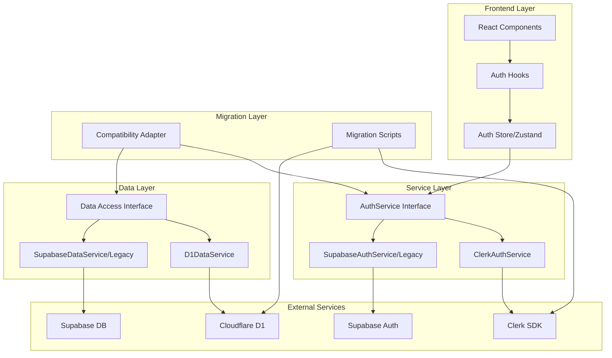

# Design Document - Authentication and Database Migration

## Overview

本设计文档详细说明了将 WebVault 从 Supabase (Auth + PostgreSQL) 迁移到 Clerk + Cloudflare D1 的技术架构和实现方案。迁移将采用渐进式策略，先建立兼容层，再逐步替换底层实现，确保系统稳定性和代码的最小改动。

## Steering Document Alignment

### Technical Standards (tech.md)
- **TypeScript 严格模式**: 所有新代码将使用严格类型检查，接口定义完整
- **Next.js 15 App Router**: 利用服务端组件处理认证，客户端组件处理 UI 交互
- **Zustand 状态管理**: 继续使用现有的 auth-store.ts 管理认证状态
- **Zod 验证**: 所有输入数据使用 Zod schema 验证，防止安全漏洞

### Project Structure (structure.md)
- **Feature First Architecture**: 新的认证和数据服务将遵循现有的功能模块结构
- **统一导出模式**: 每个模块提供 index.ts 统一导出接口
- **测试就近原则**: 单元测试放在功能模块内的 __tests__ 目录

## Code Reuse Analysis

### Existing Components to Leverage
- **AuthService.interface.ts**: 完整的认证接口定义，ClerkAuthService 将实现此接口
- **SupabaseAuthService.ts**: 现有实现可作为参考，错误处理和会话管理逻辑可复用
- **auth-store.ts**: Zustand store 结构保持不变，仅更新底层服务调用
- **auth.hooks.ts**: 现有的 useAuth, useAuthForm 等 Hooks 可继续使用
- **类型定义**: AuthUser, AuthSession, AuthError 等类型定义完全复用

### Integration Points
- **src/lib/supabase.ts**: 将被 src/lib/clerk.ts 和 src/lib/d1.ts 替代
- **API Routes**: /api/auth/* 路由将更新为使用 Clerk middleware
- **中间件**: middleware.ts 将集成 Clerk 的 authMiddleware
- **环境变量**: 新增 CLERK_* 和 CLOUDFLARE_* 配置项

## Architecture

整体架构采用适配器模式和依赖注入，确保代码的灵活性和可测试性。



## Components and Interfaces

### Component 1: ClerkAuthService
- **Purpose:** 实现 AuthService 接口，提供 Clerk 认证功能
- **Interfaces:** 
  - `signIn()`: 邮箱密码登录
  - `signInWithProvider()`: 社交登录
  - `signOut()`: 退出登录
  - `getSession()`: 获取会话
  - `getCurrentUser()`: 获取当前用户
- **Dependencies:** @clerk/nextjs, AuthService.interface
- **Reuses:** 
  - AuthError 类型定义
  - SessionManager 工具类
  - 验证工具函数

### Component 2: D1DataService
- **Purpose:** 提供 Cloudflare D1 数据访问层
- **Interfaces:**
  - `query()`: 执行 SQL 查询
  - `insert()`: 插入数据
  - `update()`: 更新数据
  - `delete()`: 删除数据
  - `transaction()`: 事务支持
- **Dependencies:** @cloudflare/d1, drizzle-orm, drizzle-kit
- **Reuses:**
  - 现有的类型定义 (Website, Category, Tag 等)
  - 数据验证 schemas
  - 错误处理工具
- **技术选型说明:** 使用 Drizzle ORM - Cloudflare 官方推荐，原生 D1 支持，边缘优先设计，性能比 Prisma 快 100+ 倍，冷启动时间短，最适合 Cloudflare Workers 环境

### Component 3: CompatibilityAdapter
- **Purpose:** 提供向后兼容的 API，最小化代码改动
- **Interfaces:**
  - `supabase.auth.*`: 路由到 ClerkAuthService
  - `supabase.from()`: 路由到 D1DataService
  - `supabase.realtime`: 返回空实现（项目不需要实时功能）
- **Dependencies:** ClerkAuthService, D1DataService
- **Reuses:** 所有现有的 Supabase 调用模式

### Component 4: MigrationToolkit
- **Purpose:** 自动化数据迁移工具集
- **Interfaces:**
  - `exportUsers()`: 导出 Supabase 用户
  - `importToClerk()`: 导入到 Clerk
  - `migrateDatabase()`: 数据库迁移
  - `validateMigration()`: 验证数据完整性
- **Dependencies:** Supabase Admin SDK, Clerk Backend API, D1 API
- **Reuses:** 批处理工具，进度追踪器

## Data Models

### Model 1: D1 Schema (SQLite)
```sql
-- User Profiles (与 Clerk 用户关联)
CREATE TABLE user_profiles (
    id TEXT PRIMARY KEY,           -- Clerk User ID
    email TEXT NOT NULL UNIQUE,
    name TEXT,
    avatar TEXT,
    role TEXT CHECK(role IN ('admin', 'user')) DEFAULT 'user',
    metadata TEXT,                  -- JSON as TEXT
    created_at TEXT DEFAULT CURRENT_TIMESTAMP,
    updated_at TEXT DEFAULT CURRENT_TIMESTAMP
);

-- Auth Lockouts (应用层实现)
CREATE TABLE auth_lockouts (
    id TEXT PRIMARY KEY,
    email TEXT NOT NULL,
    attempt_count INTEGER DEFAULT 1,
    locked_until TEXT,
    created_at TEXT DEFAULT CURRENT_TIMESTAMP,
    updated_at TEXT DEFAULT CURRENT_TIMESTAMP
);

-- 索引优化
CREATE INDEX idx_user_profiles_email ON user_profiles(email);
CREATE INDEX idx_auth_lockouts_email ON auth_lockouts(email);
```

### Model 2: Clerk User Metadata
```typescript
interface ClerkUserMetadata {
  publicMetadata: {
    role: 'admin' | 'user';
    profileId: string;  // D1 user_profiles.id
  };
  privateMetadata: {
    migrationSource?: 'supabase';
    migrationDate?: string;
  };
}
```

### Model 3: Migration Mapping
```typescript
interface MigrationRecord {
  supabaseUserId: string;
  clerkUserId: string;
  profileMigrated: boolean;
  dataMigrated: boolean;
  migratedAt: string;
  errors?: string[];
}
```

## Error Handling

### Error Scenarios

1. **Clerk API 错误**
   - **Handling:** 映射到 AuthError，提供用户友好消息
   - **User Impact:** 显示"登录服务暂时不可用"，建议稍后重试

2. **D1 连接失败**
   - **Handling:** 自动重试 3 次，失败后降级到缓存
   - **User Impact:** 只读模式提示，显示缓存数据

3. **数据迁移中断**
   - **Handling:** 记录断点，支持续传
   - **User Impact:** 管理员收到通知，可手动恢复

4. **类型不兼容**
   - **Handling:** 运行时类型检查，自动转换或报错
   - **User Impact:** 详细错误日志，迁移建议

## Testing Strategy

### Unit Testing
- **ClerkAuthService**: Mock Clerk SDK，测试所有认证场景
- **D1DataService**: Mock D1 API，测试 CRUD 操作
- **CompatibilityAdapter**: 验证接口兼容性
- **使用现有测试工具**: Jest, React Testing Library

### Integration Testing
- **认证流程**: 端到端测试登录、注册、退出
- **数据迁移**: 测试小批量数据迁移
- **兼容性**: 验证现有代码无需修改即可运行

### End-to-End Testing
- **用户场景**: 管理员登录 → 内容管理 → 发布
- **性能测试**: 并发用户测试，响应时间验证
- **故障恢复**: 模拟服务中断，测试降级策略

## Migration Strategy

### Phase 1: 环境准备（第 1 天）
1. 注册 Clerk 账号，配置应用
2. 创建 Cloudflare D1 数据库
3. 安装依赖包（@clerk/nextjs, drizzle-orm, drizzle-kit）
4. 配置环境变量

### Phase 2: 认证迁移（第 2-3 天）
1. 实现 ClerkAuthService
2. 更新认证中间件
3. 迁移用户数据到 Clerk（个人项目用户量少）
4. 测试认证流程

### Phase 3: 数据库迁移（第 4-7 天）
1. 配置 Drizzle Schema for D1
2. 实现 D1DataService with Drizzle
3. 建立兼容层
4. 迁移现有数据（数据量小，直接迁移）

### Phase 4: 验证和切换（第 8-10 天）
1. 集成测试
2. 性能验证
3. 切换到新系统
4. 监控稳定性

**说明**: 作为个人项目，数据量小，用户少，迁移可在 2 周内完成

## Performance Considerations

### 优化策略
- **边缘部署**: 利用 Cloudflare Workers 就近响应请求
- **数据库索引**: 为常用查询创建索引
- **Drizzle 查询优化**: 使用 Drizzle 的轻量级 SQL 查询，最小运行时开销
- **批处理**: 批量操作减少往返次数
- **说明**: 作为个人项目，不需要复杂的缓存策略，D1 的边缘部署已提供足够性能

### 监控指标
- 认证响应时间 (目标 < 500ms)
- 数据库查询时间 (目标 < 100ms)
- 缓存命中率 (目标 > 80%)
- 错误率 (目标 < 0.1%)

## Security Considerations

### 认证安全
- Clerk 内置的安全特性（CSRF 保护、会话管理）
- 多因素认证支持
- 社交登录的 OAuth 2.0 实现

### 数据安全
- 应用层权限检查替代 RLS
- 输入验证防止 SQL 注入
- 敏感数据加密存储
- 审计日志记录

## Rollback Plan

### 回滚触发条件
- 严重性能退化 (响应时间 > 2秒)
- 数据完整性问题
- 认证服务不可用超过 15 分钟

### 回滚步骤
1. 切换环境变量回 Supabase
2. 重启应用服务
3. 验证服务恢复
4. 分析问题原因
5. 修复后重新迁移