# Design Document - Search Page UI Implementation

## Overview

This design document details the complete technical architecture for WebVault's dedicated search page based on `design/2_Search.png`. The search page will provide a comprehensive search interface with keyword search, multi-dimensional filtering, result display, and pagination navigation. The design emphasizes component reuse, state consistency, and responsive user experience.

## Steering Document Alignment

### Technical Standards (tech.md)
- **Next.js 15 App Router**: Latest App Router architecture with SSR support
- **TypeScript Strict Mode**: Type safety and code quality assurance
- **shadcn/ui Component Library**: Reuse existing UI system for design consistency
- **Tailwind CSS**: Utility-first CSS framework with responsive design
- **Zustand State Management**: Reuse existing state patterns consistent with homepage
- **Nuqs URL Synchronization**: URL state sync supporting browser history and bookmarks

### Project Structure (structure.md)
- **Feature First Architecture**: Follow modular architecture with clear code organization
- **Route Configuration**: `src/app/(public)/search/page.tsx` - follows public page routing convention
- **Component Organization**: `src/features/websites/components/` - reuse existing component directory
- **Type Definitions**: Extend existing `src/features/websites/types/` type system
- **State Management**: Integrate with existing `src/features/websites/stores/` patterns

## Code Reuse Analysis

### Existing Components to Leverage

- **HeaderNavigation** (`src/features/websites/components/HeaderNavigation.tsx`):
  - Complete reuse of top navigation bar for website navigation consistency
  - Already includes Search link, no modifications needed

- **WebsiteCard** (`src/features/websites/components/WebsiteCard.tsx`):
  - Reuse for search result display, maintaining card style consistency
  - Supports icon, title, description, tags, visit statistics and complete functionality
  - Already includes AD marking and visit button interactions

- **Pagination** (`src/features/websites/components/Pagination.tsx`):
  - Reuse pagination navigation component for consistent pagination interaction
  - Supports page jumping and URL state synchronization

- **Footer** (`src/features/websites/components/Footer.tsx`):
  - Reuse footer component for unified page structure

- **Input & Select** (`src/components/ui/input.tsx`, `src/components/ui/select.tsx`):
  - Reuse shadcn/ui base components for form elements
  - Leverage existing styling and interaction patterns

### Integration Points

- **Existing State Management System**:
  - Extend `useHomepageFilters` hook for search page state management
  - Reuse `useHomepageUrlSync` for URL state synchronization
  - Integrate existing `WebsiteFilters` and `WebsiteCardData` types

- **Existing Data Models**:
  - Reuse `Website` and `WebsiteCardData` interfaces
  - Extend `WebsiteFilters` interface for search-specific requirements
  - Integrate existing mock data `getMockWebsites` function

- **Existing Style System**:
  - Reuse project theme colors (hsl(262.1 83.3% 57.8%))
  - Use existing shadcn/ui component variants and style conventions
  - Maintain consistent responsive layout patterns

## Architecture

The search page uses modular component architecture with extensive component reuse to ensure code reusability and user experience consistency.

```mermaid
graph TD
    A[SearchPage Main Component] --> B[HeaderNavigation]
    A --> C[SearchHeader]
    A --> D[SearchFilters]
    A --> E[SearchResults]
    A --> F[Pagination]
    A --> G[Footer]
    
    C --> C1[Search Title]
    C --> C2[Page Description]
    
    D --> D1[Search Input Box]
    D --> D2[Category Selector]
    D --> D3[Tag Selector]
    D --> D4[General Filter]
    D --> D5[Sort Selector]
    D --> D6[Reset Button]
    
    E --> E1[WebsiteCard Component Reuse]
    E --> E2[Loading State]
    E --> E3[Empty State]
    E --> E4[Error State]
    
    H[State Management Layer] --> H1[useHomepageFilters]
    H --> H2[useHomepageUrlSync]
    H --> H3[useHomepagePagination]
    
    I[Data Layer] --> I1[WebsiteFilters Interface]
    I --> I2[WebsiteCardData Interface]
    I --> I3[getMockWebsites Function]
```



## Components and Interfaces

### Component 1: SearchPage
- **Purpose**: Main search page component integrating all sub-components and state management
- **Interfaces**: 
  ```typescript
  interface SearchPageProps {
    className?: string;
    initialFilters?: WebsiteFilters;
  }
  ```
- **Dependencies**: HeaderNavigation, SearchHeader, SearchFilters, SearchResults, Pagination, Footer
- **Reuses**: HomePage overall layout structure and responsive design patterns

### Component 2: SearchHeader
- **Purpose**: Search page title area displaying "Search anything you want" and description text
- **Interfaces**:
  ```typescript
  interface SearchHeaderProps {
    className?: string;
    title?: string;
    description?: string;
  }
  ```
- **Dependencies**: No external dependencies
- **Reuses**: HeroSection typography styles and theme colors

### Component 3: SearchFilters
- **Purpose**: Search and filter control area integrating search box and various filters
- **Interfaces**:
  ```typescript
  interface SearchFiltersProps {
    className?: string;
    onSearch?: (query: string) => void;
    onFiltersChange?: (filters: WebsiteFilters) => void;
    onReset?: () => void;
  }
  ```
- **Dependencies**: Input, Select components, useHomepageFilters hook
- **Reuses**: 
  - FilterSelects dropdown selector implementation
  - HeroSection search input box styles
  - Existing debounce processing and form validation logic

### Component 4: SearchResults
- **Purpose**: Search results display container managing grid layout and various states
- **Interfaces**:
  ```typescript
  interface SearchResultsProps {
    websites: WebsiteCardData[];
    isLoading?: boolean;
    isError?: boolean;
    error?: string;
    onWebsiteVisit?: (website: WebsiteCardData) => void;
    onTagClick?: (tag: string) => void;
    className?: string;
  }
  ```
- **Dependencies**: WebsiteCard, LoadingStates components
- **Reuses**: 
  - Complete WebsiteCard component reuse for result display
  - WebsiteGrid grid layout and responsive styles
  - Existing loading state and error handling components

## Data Models

### Extended Website Filter Model
```typescript
interface SearchPageFilters extends WebsiteFilters {
  // Inherit existing filter interface
  search?: string;
  category?: string;
  tags?: string[];
  featured?: boolean;
  
  // Search page specific extensions
  searchScope?: 'title' | 'description' | 'tags' | 'all';
  sortBy?: 'relevance' | 'created_at' | 'visit_count' | 'rating';
  sortOrder?: 'asc' | 'desc';
}
```

### Search State Model
```typescript
interface SearchPageState {
  // Search state
  query: string;
  filters: SearchPageFilters;
  
  // Result state
  results: WebsiteCardData[];
  totalResults: number;
  isLoading: boolean;
  error?: string;
  
  // Pagination state (reuse existing PaginationState)
  pagination: PaginationState;
  
  // UI state
  ui: {
    resultsViewMode: 'grid' | 'list';
    filtersCollapsed: boolean;
  };
}
```

### URL Parameters Model
```typescript
interface SearchURLParams {
  q?: string;          // Search keywords
  category?: string;   // Category filter
  tags?: string;       // Tag filter (comma-separated)
  featured?: string;   // Featured filter
  sort?: string;       // Sort method
  page?: string;       // Current page
  limit?: string;      // Items per page
}
```

## Error Handling

### Error Scenarios
1. **Network Request Failure**
   - **Handling**: Use existing ErrorBoundary component wrapper, display friendly error message
   - **User Impact**: Display "Network connection failed, please check network and retry", provide retry button

2. **Empty Search Results**
   - **Handling**: Display empty state component with search suggestions
   - **User Impact**: Display "No relevant results found, try adjusting search criteria", show popular search suggestions

3. **URL Parameter Parsing Error**
   - **Handling**: Use default parameters to restore state, log error
   - **User Impact**: Automatically restore to default search state, uninterrupted user experience

4. **Search Input Validation Failure**
   - **Handling**: Reuse existing form validation logic, display validation error messages
   - **User Impact**: Real-time display of input error prompts, guide users to correct input

## Testing Strategy

### Unit Testing
- **SearchFilters Component**: Test filter condition changes, reset functionality, form validation
- **SearchResults Component**: Test rendering under different states (loading, success, error, empty results)
- **URL State Sync**: Test bidirectional sync between URL parameters and component state
- **Search Logic**: Test debounce processing, parameter construction, state updates

### Integration Testing
- **Page Routing**: Test correct rendering and parameter passing of `/search` route
- **Component Interaction**: Test linkage between filters and result display
- **State Management**: Test integration between Zustand store and URL sync
- **Pagination Functionality**: Test integration between pagination component and search state

### End-to-End Testing
- **Search Process**: Complete user path from keyword input to result display
- **Filter Functionality**: Multi-condition filtering and reset user operation scenarios
- **Pagination Navigation**: Page switching and URL state sync user experience
- **Responsive Layout**: Layout and interaction testing across different device sizes

## Implementation Notes

### Performance Optimizations
- **Component Lazy Loading**: Use React.lazy() to defer loading of non-critical components
- **Search Debouncing**: Reuse existing debounce logic, 300ms delay for search execution
- **Result Virtualization**: Consider virtual scrolling for performance optimization with large result sets
- **State Caching**: Use Zustand persistence to cache user preference settings

### Accessibility Considerations
- **Keyboard Navigation**: Support Tab key navigation between filters, Enter key to execute search
- **Screen Readers**: Add appropriate ARIA labels for search box, filters, and results
- **Contrast**: Ensure all text and background contrast ratios meet WCAG standards
- **Focus Management**: Auto-focus to results area after search execution

### Mobile Optimizations
- **Touch Friendly**: Increase mobile click areas, optimize touch experience
- **Filter Collapsing**: Default collapsed filters on mobile, click to expand
- **Swipe Gestures**: Support left-right swipe to switch result pages
- **Search Suggestions**: Provide search history and popular suggestions on mobile

### SEO Considerations
- **Server-Side Rendering**: Use Next.js SSR to ensure search results are indexable
- **Structured Data**: Add Schema.org markup for search results
- **URL Structure**: Use semantic URLs that search engines can understand
- **Metadata**: Dynamically generate page titles and descriptions including search keywords