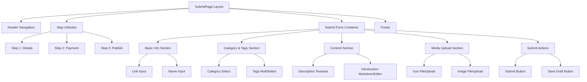

# Design - Submit Page UI

## Status
- **Phase**: Design  
- **Status**: Complete
- **Date Created**: 2025-08-18
- **Last Updated**: 2025-08-18

## Overview

基于设计图 `9_Submit.png` 和已验证的需求文档，设计WebVault网站提交页面的完整技术方案。该设计采用现代化分步表单模式，使用Next.js 15 + React Hook Form + Zod实现高质量的用户体验，支持完整的文件上传、富文本编辑和表单验证功能。

## Steering Document Alignment

### Technical Standards (tech.md)
- **Next.js 15 App Router** - 使用最新的应用路由系统，支持服务端组件和客户端交互
- **TypeScript严格模式** - 确保类型安全，特别是表单数据和API接口
- **React Hook Form v7.62.0 + Zod v4.0.17** - 现有技术栈，用于表单管理和验证
- **shadcn/ui组件系统** - 基于Radix UI的现代组件，保持设计一致性
- **Feature-First架构** - 创建 `src/features/submissions/` 模块
- **现有UI组件**: Button, Input, Card, Select, Form等已配置组件
- **主题系统**: HSL配色系统已在全局样式中定义

### Project Structure (structure.md)  
- **功能模块放置**: `src/features/submissions/` 按业务域组织
- **组件结构**: `components/`, `hooks/`, `types/`, `schemas/` 等标准目录
- **页面路由**: 现有 `src/app/(public)/submit/page.tsx` 需重构
- **API接口**: `src/app/api/submissions/` 用于数据提交
- **状态管理**: 整合 `src/stores/` 和模块内状态
- **类型定义**: 遵循现有类型管理模式

## Code Reuse Analysis

### Existing Components to Leverage
- **表单系统完整复用**: `src/components/ui/form.tsx` - 提供FormField, FormItem, FormLabel, FormControl, FormMessage等完整组件
- **已配置的shadcn/ui组件**: `src/components/ui/input.tsx`, `select.tsx`, `button.tsx`, `card.tsx`, `label.tsx`
- **成熟的表单Hook模式**: `src/features/auth/hooks/useAuthForm.ts` - 提供完整的表单状态管理、验证和提交逻辑模板
- **安全验证基础设施**: `src/features/websites/schemas/index.ts` - 提供`detectMaliciousContent`, `safeStringValidator`, `FORM_ERROR_MESSAGES`等安全工具
- **Zod集成模式**: 现有的`zodResolver`和验证schema模式
- **布局组件**: `src/components/layout/` - 页面框架和导航（需要检查具体实现）

### Integration Points  
- **认证表单模式完全复用**: 参考`useAuthForm.ts`的实现模式，创建`useSubmissionForm`
- **安全验证直接使用**: 复用`detectMaliciousContent`和`safeStringValidator`进行输入验证
- **表单组件直接组装**: 使用现有的Form组件体系，无需自定义表单组件
- **错误处理统一**: 使用现有的错误消息模式和`FORM_ERROR_MESSAGES`结构
- **路由集成**: 与现有的`src/app/(public)/submit/page.tsx`路由集成

### Minimal New Components Required (精简设计)
- **StepIndicator组件** - 简单的步骤指示器，使用现有的card和button样式
- **FileUploadField组件** - 基于现有Input组件扩展，添加拖拽功能
- **TextareaField组件** - 基于现有表单模式的多行文本输入
- **CategoryTagSelect组件** - 基于现有Select组件的分类和标签选择器

### 移除过度设计的组件
- ~~MarkdownEditor组件~~ → 第一阶段使用简单的textarea，后期优化时再添加
- ~~复杂的FileUpload组件~~ → 简化为基于现有Input的文件选择
- ~~独立的表单容器~~ → 直接使用现有的Form组件体系

## Architecture

采用组件化分层架构，支持客户端交互和服务端渲染的混合模式。



## Components and Interfaces

### SubmitPage (主页面组件)
- **Purpose:** 网站提交页面的根容器，管理整体布局和路由
- **Interfaces:**
```typescript
interface SubmitPageProps {
  searchParams?: {
    step?: string;
    draft?: string;
  };
}
```
- **Dependencies:** HeaderNavigation, StepIndicator, SubmitFormContainer, Footer
- **Reuses:** 现有的Layout组件和页面框架模式

### StepIndicator (步骤指示器)
- **Purpose:** 显示三步骤提交流程的当前进度
- **Interfaces:**
```typescript
interface StepIndicatorProps {
  currentStep: 1 | 2 | 3;
  steps: Array<{ id: number; label: string; status: 'current' | 'completed' | 'upcoming' }>;
}
```
- **Dependencies:** 无外部依赖
- **Reuses:** shadcn/ui的样式系统和主题变量

### SubmitFormContainer (表单容器组件)
- **Purpose:** 统筹管理所有表单状态、验证和提交逻辑
- **Interfaces:**
```typescript
interface SubmitFormContainerProps {
  initialData?: Partial<SubmissionFormData>;
  onSubmit: (data: SubmissionFormData) => Promise<void>;
  onSaveDraft?: (data: Partial<SubmissionFormData>) => Promise<void>;
}
```
- **Dependencies:** React Hook Form, Zod validation, useSubmissionForm hook
- **Reuses:** `src/features/auth/hooks/useAuthForm.ts` 的表单管理模式

### FileUpload (文件上传组件)
- **Purpose:** 支持拖拽和点击上传的文件上传组件
- **Interfaces:**
```typescript
interface FileUploadProps {
  accept: string;
  maxSize: number;
  onFileSelect: (file: File) => void;
  onFileRemove: () => void;
  value?: File | string;
  label: string;
  error?: string;
  loading?: boolean;
}
```
- **Dependencies:** 文件验证工具，进度状态管理
- **Reuses:** `src/components/ui/` 的基础样式和错误状态模式

### MarkdownEditor (富文本编辑器)
- **Purpose:** 支持Markdown语法的富文本内容编辑器
- **Interfaces:**
```typescript
interface MarkdownEditorProps {
  value: string;
  onChange: (value: string) => void;
  placeholder?: string;
  error?: string;
  maxLength?: number;
  showPreview?: boolean;
}
```
- **Dependencies:** Markdown解析库，语法高亮
- **Reuses:** `src/components/ui/` 的输入框样式和验证反馈

### CategorySelect (分类选择器)
- **Purpose:** 网站分类的下拉选择组件
- **Interfaces:**
```typescript
interface CategorySelectProps {
  value?: string;
  onChange: (value: string) => void;
  error?: string;
  disabled?: boolean;
  categories: Category[];
}
```
- **Dependencies:** 分类数据获取，Radix UI Select
- **Reuses:** `src/components/ui/select.tsx` 和现有分类数据模型

### TagsMultiSelect (标签多选器)
- **Purpose:** 支持多选的网站标签选择组件
- **Interfaces:**
```typescript
interface TagsMultiSelectProps {
  value: string[];
  onChange: (value: string[]) => void;
  error?: string;
  disabled?: boolean;
  tags: Tag[];
  maxSelection?: number;
}
```
- **Dependencies:** 标签数据获取，多选交互逻辑
- **Reuses:** `src/components/ui/select.tsx` 和标签数据模型

## Data Models

### SubmissionFormData (表单数据模型)
```typescript
interface SubmissionFormData {
  // 基础信息
  link: string;
  name: string;
  description: string;
  introduction: string;
  
  // 分类和标签
  categoryId: string;
  tagIds: string[];
  
  // 媒体文件
  iconFile?: File | null;
  imageFile?: File | null;
  
  // 元数据
  submittedBy?: string;
  status: 'draft' | 'submitted' | 'pending' | 'approved' | 'rejected';
  createdAt: string;
  updatedAt: string;
  
  // 可选字段
  metaTitle?: string;
  metaDescription?: string;
  expectedTraffic?: string;
  monetization?: string;
}
```

### Category (分类数据模型)
```typescript  
interface Category {
  id: string;
  name: string;
  slug: string;
  description?: string;
  parentId?: string;
  isActive: boolean;
  submissionGuidelines?: string;
}
```

### Tag (标签数据模型)
```typescript
interface Tag {
  id: string;
  name: string;
  slug: string;
  color?: string;
  isActive: boolean;
  usageCount: number;
}
```

### FileUploadState (上传状态模型)
```typescript
interface FileUploadState {
  file: File | null;
  preview?: string;
  uploading: boolean;
  uploaded: boolean;
  uploadProgress: number;
  error?: string;
  url?: string;
}
```

## Validation Schema (Zod) - 复用现有安全基础设施

```typescript
import { z } from 'zod';
import { zodResolver } from '@hookform/resolvers/zod';
// 复用现有的安全验证工具
import { 
  detectMaliciousContent, 
  safeStringValidator,
  FORM_ERROR_MESSAGES 
} from '@/features/websites/schemas';

/**
 * 文件验证函数 - 基于现有安全模式
 */
const validateUploadFile = (file: File, maxSize: number = 5 * 1024 * 1024) => {
  return z.instanceof(File)
    .refine(file => file.size <= maxSize, '文件大小不能超过5MB')
    .refine(file => ['image/png', 'image/jpeg', 'image/jpg'].includes(file.type), '只支持PNG和JPEG格式')
    .refine(file => file.name.length <= 255, '文件名过长')
    .optional();
};

/**
 * URL验证函数 - 增强安全性
 */
const validateWebsiteUrl = () => {
  return z.string()
    .min(1, '网站链接为必填项')
    .url('请输入有效的网站链接')
    .refine(url => {
      try {
        const parsed = new URL(url);
        // 只允许 http 和 https 协议
        return ['http:', 'https:'].includes(parsed.protocol);
      } catch {
        return false;
      }
    }, '只支持HTTP和HTTPS协议的网站链接')
    .refine(url => !detectMaliciousContent(url), '网站链接包含不安全的内容');
};

/**
 * 网站提交表单验证Schema - 完全基于现有模式
 */
export const submissionFormSchema = z.object({
  // 基础信息 - 复用现有的安全验证
  link: validateWebsiteUrl(),
  
  name: safeStringValidator('网站名称', 100)
    .min(3, '网站名称至少需要3个字符'),
    
  description: safeStringValidator('网站描述', 500)
    .min(10, '描述至少需要10个字符'),
    
  introduction: safeStringValidator('详细介绍', 5000)
    .min(50, '详细介绍至少需要50个字符'),
    
  // 分类和标签
  categoryId: z.string()
    .min(1, '请选择网站分类')
    .uuid('无效的分类ID'),
    
  tagIds: z.array(z.string().uuid('无效的标签ID'))
    .min(1, '请至少选择一个标签')
    .max(10, '最多只能选择10个标签'),
    
  // 文件上传 - 使用统一的文件验证
  iconFile: validateUploadFile(),
  imageFile: validateUploadFile(),
  
  // 反机器人验证 - 复用现有蜜罐模式
  honeypot: z.string()
    .optional()
    .refine((value) => !value || value === '', '检测到异常提交'),
});

export type SubmissionFormData = z.infer<typeof submissionFormSchema>;

// React Hook Form集成 - 遵循现有模式
export const submissionFormResolver = zodResolver(submissionFormSchema);

// 表单默认值 - 遵循现有模式
export const submissionFormDefaults: Partial<SubmissionFormData> = {
  link: '',
  name: '',
  description: '',
  introduction: '',
  categoryId: '',
  tagIds: [],
  honeypot: '',
};

// 错误消息 - 扩展现有的错误消息结构
export const SUBMISSION_ERROR_MESSAGES = {
  ...FORM_ERROR_MESSAGES,
  SUBMISSION: {
    LINK_REQUIRED: '请输入网站链接',
    LINK_INVALID: '请输入有效的网站链接',
    NAME_REQUIRED: '请输入网站名称',
    NAME_TOO_SHORT: '网站名称至少需要3个字符',
    DESCRIPTION_REQUIRED: '请输入网站描述',
    DESCRIPTION_TOO_SHORT: '描述至少需要10个字符',
    CATEGORY_REQUIRED: '请选择网站分类',
    TAGS_REQUIRED: '请至少选择一个标签',
    FILE_TOO_LARGE: '文件大小不能超过5MB',
    FILE_INVALID_TYPE: '只支持PNG和JPEG格式',
    UNSAFE_CONTENT: '内容包含不安全的字符，请移除脚本标签等危险内容',
  },
} as const;
```

## State Management - 完全基于现有useAuthForm模式

### useSubmissionForm Hook - 复用认证表单架构
```typescript
// 完全基于 src/features/auth/hooks/useAuthForm.ts 的模式
import { useCallback, useMemo, useEffect, useState } from 'react';
import { useForm, UseFormReturn } from 'react-hook-form';
import { 
  SubmissionFormData,
  submissionFormResolver,
  submissionFormDefaults,
  SUBMISSION_ERROR_MESSAGES,
} from '../schemas/submission-schemas';

/**
 * 表单配置选项 - 复用useAuthForm的接口设计
 */
interface UseSubmissionFormOptions {
  initialData?: Partial<SubmissionFormData>;
  autosave?: boolean;
  onSubmitSuccess?: (result: SubmissionResult) => void;
  onSubmitError?: (error: string) => void;
  debug?: boolean;
}

/**
 * 表单提交结果 - 遵循现有模式
 */
interface SubmissionResult {
  success: boolean;
  data?: {
    id: string;
    status: 'draft' | 'submitted';
    message: string;
  };
  error?: string;
}

/**
 * Hook返回值 - 复用useAuthForm的接口结构
 */
interface UseSubmissionFormReturn {
  // React Hook Form实例 - 与useAuthForm一致
  form: UseFormReturn<SubmissionFormData>;
  
  // 表单状态 - 复用useAuthForm的状态管理
  isSubmitting: boolean;
  isDirty: boolean;
  isValid: boolean;
  hasErrors: boolean;
  submitError: string | null;
  
  // 表单操作 - 遵循useAuthForm的操作模式
  handleSubmit: (data: SubmissionFormData) => Promise<void>;
  clearForm: () => void;
  clearError: () => void;
  resetForm: () => void;
  
  // 验证工具 - 复用useAuthForm的验证模式
  validateField: (fieldName: keyof SubmissionFormData, value: any) => Promise<boolean>;
  
  // 扩展功能（简化版本）
  saveDraft: () => Promise<void>;
  isDraftSaving: boolean;
}

/**
 * 实现示例 - 完全参考useAuthForm.ts的结构
 */
export function useSubmissionForm(options: UseSubmissionFormOptions): UseSubmissionFormReturn {
  const {
    initialData,
    autosave = false,
    onSubmitSuccess,
    onSubmitError,
    debug = false,
  } = options;

  // React Hook Form 初始化 - 复用useAuthForm模式
  const form = useForm<SubmissionFormData>({
    resolver: submissionFormResolver,
    defaultValues: { ...submissionFormDefaults, ...initialData },
    mode: 'onSubmit',
    reValidateMode: 'onBlur',
    criteriaMode: 'firstError',
  });

  const {
    handleSubmit: hookFormHandleSubmit,
    reset,
    clearErrors,
    formState: { isSubmitting, isValid, isDirty, errors },
    trigger,
  } = form;

  // 状态管理 - 复用useAuthForm的状态模式
  const [submitError, setSubmitError] = useState<string | null>(null);
  const [isDraftSaving, setIsDraftSaving] = useState(false);

  // 错误处理 - 复用useAuthForm的错误处理逻辑
  const handleError = useCallback((error: unknown) => {
    let errorMessage: string;
    if (error instanceof Error) {
      errorMessage = error.message;
    } else if (typeof error === 'string') {
      errorMessage = error;
    } else {
      errorMessage = '提交失败，请重试';
    }
    setSubmitError(errorMessage);
    if (onSubmitError) onSubmitError(errorMessage);
  }, [onSubmitError]);

  // 其他方法实现...
  // 完全遵循useAuthForm.ts的实现模式
}
```
```

### URL State Management
使用nuqs管理URL状态，支持分步导航和草稿恢复：
```typescript
const useSubmissionUrlState = () => {
  const [step, setStep] = useQueryState('step', parseAsInteger.withDefault(1));
  const [draftId, setDraftId] = useQueryState('draft', parseAsString);
  
  return {
    currentStep: step,
    navigateToStep: setStep,
    draftId,
    setDraftId,
  };
};
```

## Error Handling

### Error Scenarios
1. **表单验证错误**
   - **Handling:** 实时显示字段级错误，滚动到第一个错误位置
   - **User Impact:** 红色边框高亮，清晰错误信息，阻止提交

2. **文件上传失败**  
   - **Handling:** 重试机制，进度指示，文件格式验证
   - **User Impact:** 上传进度条，失败时显示重试按钮

3. **网络请求失败**
   - **Handling:** 指数退避重试，本地草稿保存，离线检测
   - **User Impact:** Toast通知，保留用户输入，提供重试选项

4. **服务器验证错误**
   - **Handling:** 解析后端错误消息，映射到对应字段
   - **User Impact:** 字段级错误显示，保持用户已填写内容

## Security Implementation

### 输入安全
- 所有文本输入使用DOMPurify进行XSS防护
- 文件上传验证真实MIME类型，不仅依赖扩展名
- 限制文件大小和数量，防止DoS攻击
- URL验证确保协议安全（http/https only）

### 表单安全
- CSRF令牌验证（Next.js内置）
- 请求频率限制，防止暴力提交
- 文件内容扫描（服务端实现）
- 敏感信息检测和过滤

## Performance Optimization

### 文件上传优化
- 图片压缩和缩略图生成
- 断点续传支持
- 并行上传多个文件
- CDN存储和访问加速

### 表单体验优化
- 防抖输入验证减少计算
- 智能自动保存（每30秒或内容变化时）
- 组件懒加载和代码分割
- 预加载分类和标签数据

### 内存管理
- 文件上传完成后清理File对象
- 及时销毁富文本编辑器实例
- 优化大表单的重新渲染

## Responsive Design Strategy

### 移动端适配 (<768px)
- 单列表单布局，垂直排列所有字段
- 文件上传区域调整为全宽布局
- 富文本编辑器简化工具栏
- 触摸友好的44px最小点击区域

### 平板端适配 (768px-1024px)
- 保持两列布局但调整间距
- 富文本编辑器完整工具栏
- 模态框和下拉菜单适应屏幕尺寸

### 桌面端优化 (>1024px)
- 最大宽度1200px居中布局
- 并排的Icon和Image上传区域
- 完整的富文本编辑器功能
- 悬停状态和快捷键支持

## Testing Strategy

### Unit Testing
- 表单验证逻辑测试（Zod schema）
- 文件上传组件的文件处理逻辑
- 状态管理Hook的业务逻辑测试
- 工具函数的输入输出测试

### Integration Testing  
- 表单提交的完整流程测试
- 文件上传与表单集成测试
- 错误处理和用户反馈测试
- URL状态同步和导航测试

### End-to-End Testing
- 用户完整提交网站的流程测试
- 不同设备尺寸的响应式测试
- 文件上传和表单验证的用户体验测试
- 错误场景和边界条件测试

## API Integration Design

### 提交接口设计
```typescript
// POST /api/submissions
interface SubmissionCreateRequest {
  formData: SubmissionFormData;
  files: {
    icon?: File;
    image?: File;
  };
}

interface SubmissionCreateResponse {
  success: boolean;
  data?: {
    id: string;
    status: string;
    estimatedReviewTime: string;
  };
  error?: string;
}
```

### 草稿保存接口
```typescript
// PUT /api/submissions/draft/{id}
interface DraftSaveRequest {
  formData: Partial<SubmissionFormData>;
}

interface DraftSaveResponse {
  success: boolean;
  draftId: string;
  lastSaved: string;
}
```

## Accessibility Compliance

### WCAG 2.1 AA标准
- 所有表单字段提供明确的label和描述
- 错误信息与字段关联，支持屏幕阅读器
- 颜色对比度符合4.5:1要求
- 键盘导航支持Tab/Shift+Tab完整遍历

### 交互可访问性
- 文件上传支持键盘操作
- 富文本编辑器提供快捷键说明
- 所有状态变化提供aria-live通知
- 表单验证错误支持aria-invalid属性