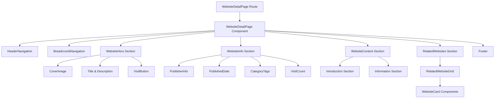
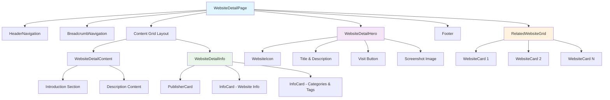
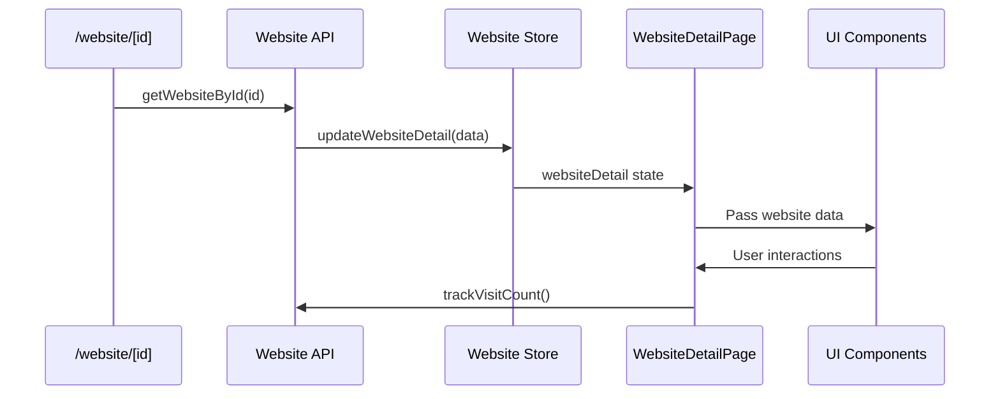

# Design - Web Detail UI

> 网站详情页面UI设计方案
> 基于 @design/7_item_detail.png 设计图实现

## 1. Architecture Overview

### 1.1 Feature Architecture



### 1.2 Component Hierarchy



### 1.3 Data Flow Design



## 2. Steering Document Alignment

### 2.1 Technical Standards (tech.md)

**Feature First Architecture 遵循：**
- 所有组件放置在 `src/features/websites/components/` 下
- 状态管理使用 Zustand，遵循现有 store 模式
- 使用 TypeScript 严格模式和现有类型约定
- 复用 shadcn/ui 设计系统和组件库

**技术栈对齐：**
- Next.js 15 App Router 实现动态路由
- React Server Components 和 Client Components 合理分离
- Tailwind CSS 使用现有主题变量和设计 token

### 2.2 Project Structure (structure.md)

**文件组织遵循项目约定：**
```
src/features/websites/
├── components/
│   ├── WebsiteDetailPage.tsx          # 主页面容器组件
│   ├── WebsiteDetailHero.tsx          # 英雄区域组件  
│   ├── WebsiteDetailInfo.tsx          # 信息展示组件
│   ├── WebsiteDetailContent.tsx       # 内容区域组件
│   ├── RelatedWebsiteGrid.tsx         # 相关推荐组件
│   ├── BreadcrumbNavigation.tsx       # 面包屑导航组件
│   └── PublisherCard.tsx             # 发布者信息卡片
├── types/
│   └── detail.ts                      # 详情页类型定义
├── stores/
│   └── websiteDetailStore.ts          # 详情页状态管理
└── services/
    └── websiteDetailService.ts        # 详情页服务层

src/app/(public)/website/[id]/
├── page.tsx                           # 主路由页面
├── loading.tsx                        # 加载状态页面
└── not-found.tsx                      # 404错误页面
```

### 2.3 Product Vision Alignment

**支持核心产品目标：**
- **网站发现性**：通过详细信息展示帮助用户做出访问决策
- **内容信任度**：通过发布者信息和规范化展示建立用户信任
- **用户体验**：提供快速、响应式的浏览体验
- **内容探索**：通过相关推荐促进更多网站发现

## 3. Code Reuse Analysis

### 3.1 现有组件直接复用

**已验证可直接复用的组件：**
- `HeaderNavigation`: 页面顶部导航栏，无需修改
- `Footer`: 页面底部组件，直接引用
- `WebsiteCard`: 用于相关推荐网站展示，完全适配
- `TagPill`: 用于标签展示，现有样式和交互符合需求
- `Button`: shadcn/ui 按钮组件，用于访问按钮

### 3.2 可扩展复用的组件

**需要轻微扩展的现有组件：**
- `WebsiteIcon`: 现有图标组件，需要添加大尺寸 variant
- `LoadingStates`: 现有加载状态组件，复用加载动画
- `ErrorBoundary`: 现有错误边界，包装详情页面组件

### 3.3 现有样式系统复用

**复用现有 CSS 类和动画：**
```css
/* 复用现有动画类 */
.website-detail-fade-in {
  /* 使用 blog 系统中的 blog-content-fade-in 动画 */
}

/* 复用现有布局类 */
.website-detail-layout {
  /* 使用 BlogDetailPage 的响应式布局模式 */
}
```

### 3.4 状态管理模式复用

**基于现有 Zustand store 模式：**
- 复用 `blog/stores/blogDetailStore.ts` 的状态结构
- 采用相同的异步action模式和错误处理
- 集成现有的 URL 状态同步（nuqs）

## 4. Components and Interfaces

### 4.1 WebsiteDetailPage (主容器组件)
- **Purpose:** 网站详情页面的主容器组件，协调所有子组件和状态管理
- **Type:** Client Component 
- **Interfaces:**
  - Props: `WebsiteDetailComponentProps`
  - Events: `handleWebsiteVisit` 回调处理访问统计
- **Dependencies:** HeaderNavigation, Footer, WebsiteDetailHero, WebsiteDetailInfo, WebsiteDetailContent, RelatedWebsiteGrid
- **Reuses:** BlogDetailPage 的滚动状态管理模式，现有动画类

### 4.2 WebsiteDetailHero (英雄区域组件)
- **Purpose:** 展示网站标题、描述、图标和访问按钮
- **Type:** Client Component
- **Interfaces:**
  - Props: `website: WebsiteDetailData, onVisit: Function, className?: string`
  - Events: `onVisit` 访问按钮点击事件
- **Dependencies:** Button (shadcn/ui), WebsiteIcon, Image
- **Reuses:** shadcn/ui Button 组件，现有图标组件模式

### 4.3 WebsiteDetailInfo (信息展示组件)
- **Purpose:** 右侧信息栏，显示发布者、分类、标签等元数据
- **Type:** Client Component
- **Interfaces:**
  - Props: `website: WebsiteDetailData, className?: string`
- **Dependencies:** Card, PublisherCard, TagPill, CategoryTag
- **Reuses:** shadcn/ui Card 组件，现有 TagPill 组件

### 4.4 RelatedWebsiteGrid (相关推荐组件)
- **Purpose:** 展示相关网站推荐网格
- **Type:** Client Component
- **Interfaces:**
  - Props: `websites: WebsiteCardData[], currentWebsiteId: string, className?: string`
- **Dependencies:** WebsiteCard
- **Reuses:** 完全复用现有 WebsiteCard 组件和网格布局

### 4.5 BreadcrumbNavigation (面包屑导航组件)
- **Purpose:** 显示页面层级导航：Home > 分类 > 网站名称
- **Type:** Client Component
- **Interfaces:**
  - Props: `website: WebsiteDetailData, className?: string`
- **Dependencies:** Link (Next.js), ChevronRight 图标
- **Reuses:** 复用博客详情页面的面包屑模式

### 4.6 PublisherCard (发布者信息卡片)
- **Purpose:** 展示网站发布者信息，包括头像、姓名、简介
- **Type:** Client Component
- **Interfaces:**
  - Props: `publisher: PublisherInfo, publishedDate: string, className?: string, showBio?: boolean`
- **Dependencies:** Avatar, Typography 组件
- **Reuses:** 参考 AuthorCard 组件的设计模式

## 5. Data Models

### 5.1 核心数据模型

```typescript
// 网站详情数据接口 - 扩展现有 Website 接口
export interface WebsiteDetailData extends Website {
  // 继承 Website 的所有字段：
  // id, title, description, url, tags, favicon_url, screenshot_url
  // category_id, status, isAd, adType, rating, visitCount, is_featured
  // is_public, created_at, updated_at
  
  // 详情页扩展字段
  publisher?: PublisherInfo;
  introduction?: string;
  fullDescription?: string;
  relatedWebsites?: WebsiteCardData[];
  seoTitle?: string;
  seoDescription?: string;
  keywords?: string[];
}

// 发布者信息
export interface PublisherInfo {
  name: string;
  avatar?: string;
  bio?: string;
}
```

### 5.2 类型兼容性说明

**现有类型对齐：**
- `Website.visitCount` (number) - 主数据模型使用
- `WebsiteCardData.visit_count` (number) - 卡片组件使用蛇形命名
- `WebsiteCardData.image_url` - 卡片使用，对应 `Website.screenshot_url`

**处理策略：**
在组件中进行字段映射，保持现有类型不变：
```typescript
// 在 RelatedWebsiteGrid 中转换数据
const cardData: WebsiteCardData = {
  ...website,
  visit_count: website.visitCount,
  image_url: website.screenshot_url,
};
```

## 6. Technical Design

### 6.1 Type Definitions

**基于现有类型扩展，保持完全一致：**

```typescript
// src/features/websites/types/detail.ts
import { Website, WebsiteCardData } from './website';

// 发布者信息接口
export interface PublisherInfo {
  name: string;
  avatar?: string;
  bio?: string;
}

// 网站详情数据接口 - 扩展现有 Website 接口
export interface WebsiteDetailData extends Website {
  // 继承所有现有 Website 字段，包括 visitCount
  // 注意：现有 WebsiteCardData 使用 visit_count，但 Website 使用 visitCount
  
  // 详情页扩展字段
  publisher?: PublisherInfo;
  
  // 内容详情
  introduction?: string;
  fullDescription?: string;
  
  // 相关推荐 - 使用现有 WebsiteCardData 类型
  relatedWebsites?: WebsiteCardData[];
  
  // SEO 数据
  seoTitle?: string;
  seoDescription?: string;
  keywords?: string[];
}

// URL 参数类型
export interface WebsiteDetailParams {
  id: string;
}

// 页面属性接口
export interface WebsiteDetailPageProps {
  params: Promise<WebsiteDetailParams>;
}

// 组件属性接口
export interface WebsiteDetailComponentProps {
  initialData: WebsiteDetailData;
  className?: string;
  showNavigation?: boolean;
  showFooter?: boolean;
}
```

### 4.2 Route Implementation

**遵循 Next.js 15 App Router 模式：**

```typescript
// src/app/(public)/website/[id]/page.tsx
import { Metadata } from 'next';
import { notFound } from 'next/navigation';
import { WebsiteDetailPage } from '@/features/websites/components';
import { getWebsiteById } from '@/features/websites/services/websiteDetailService';
import { generateWebsiteMetadata } from '@/features/websites/utils/seoUtils';

export const dynamic = 'force-dynamic';

export async function generateMetadata({ params }: WebsiteDetailPageProps): Promise<Metadata> {
  try {
    const { id } = await params;
    const website = await getWebsiteById(id);
    return generateWebsiteMetadata(website);
  } catch (error) {
    return {
      title: '网站未找到 - WebVault',
      description: '抱歉，您访问的网站不存在或已被删除。',
    };
  }
}

export default async function WebsiteDetailRoute({ params }: WebsiteDetailPageProps) {
  const { id } = await params;
  
  // 验证参数
  if (!id || typeof id !== 'string') {
    notFound();
  }
  
  // 获取网站数据
  let websiteData: WebsiteDetailData;
  try {
    websiteData = await getWebsiteById(id);
  } catch (error) {
    notFound();
  }
  
  // 权限和状态检查
  if (!websiteData.is_public || websiteData.status !== 'active') {
    notFound();
  }
  
  return <WebsiteDetailPage initialData={websiteData} />;
}
```

### 4.3 Component Architecture

**主容器组件设计：**

```typescript
// src/features/websites/components/WebsiteDetailPage.tsx
'use client';

import React, { useState, useCallback } from 'react';
import { cn } from '@/lib/utils';
import { HeaderNavigation } from './HeaderNavigation';
import { Footer } from './Footer';
import { WebsiteDetailHero } from './WebsiteDetailHero';
import { WebsiteDetailInfo } from './WebsiteDetailInfo';
import { WebsiteDetailContent } from './WebsiteDetailContent';
import { RelatedWebsiteGrid } from './RelatedWebsiteGrid';
import { BreadcrumbNavigation } from './BreadcrumbNavigation';
import { trackWebsiteVisit } from '../services/websiteDetailService';
import type { WebsiteDetailComponentProps, WebsiteDetailData } from '../types/detail';

export function WebsiteDetailPage({
  initialData,
  className,
  showNavigation = true,
  showFooter = true,
}: WebsiteDetailComponentProps) {
  
  // 复用 BlogDetailPage 的滚动状态管理模式
  const [isScrolled, setIsScrolled] = useState(false);
  
  React.useEffect(() => {
    const handleScroll = () => {
      setIsScrolled(window.scrollY > 100);
    };
    
    let timeoutId: NodeJS.Timeout;
    const throttledHandleScroll = () => {
      clearTimeout(timeoutId);
      timeoutId = setTimeout(handleScroll, 16);
    };

    window.addEventListener('scroll', throttledHandleScroll, { passive: true });
    return () => {
      window.removeEventListener('scroll', throttledHandleScroll);
      clearTimeout(timeoutId);
    };
  }, []);
  
  // 访问统计处理
  const handleWebsiteVisit = useCallback(async (website: WebsiteDetailData) => {
    try {
      await trackWebsiteVisit(website.id);
      window.open(website.url, '_blank', 'noopener,noreferrer');
    } catch (error) {
      console.error('Failed to track visit:', error);
      // 即使统计失败也要打开网站
      window.open(website.url, '_blank', 'noopener,noreferrer');
    }
  }, []);
  
  return (
    <div 
      className={cn(
        'min-h-screen bg-background flex flex-col',
        className
      )}
      role="main"
      aria-label="网站详情页面"
    >
      {/* 导航栏 */}
      {showNavigation && (
        <div className={cn(
          "navbar-fixed",
          isScrolled && "navbar-scrolled"
        )}>
          <HeaderNavigation />
        </div>
      )}
      
      {/* 主内容区域 */}
      <main className="flex-1">
        <div className="mx-auto max-w-4xl px-6 sm:px-8 lg:px-12">
          
          {/* 面包屑导航 */}
          <div className="pt-8 sm:pt-12 lg:pt-16 pb-6">
            <BreadcrumbNavigation 
              website={initialData}
              className="website-detail-fade-in"
            />
          </div>
          
          {/* 英雄区域 */}
          <WebsiteDetailHero 
            website={initialData}
            onVisit={handleWebsiteVisit}
            className="website-detail-fade-in mb-12"
          />
          
          {/* 响应式双列布局 */}
          <div className="lg:grid lg:grid-cols-12 lg:gap-8 mb-12">
            {/* 主内容区域 */}
            <div className="lg:col-span-8">
              <WebsiteDetailContent 
                website={initialData}
                className="website-detail-fade-in"
              />
            </div>
            
            {/* 侧边信息栏 */}
            <div className="lg:col-span-4 lg:sticky lg:top-24 lg:self-start">
              <WebsiteDetailInfo 
                website={initialData}
                className="website-detail-fade-in"
              />
            </div>
          </div>
          
          {/* 相关推荐 */}
          {initialData.relatedWebsites && initialData.relatedWebsites.length > 0 && (
            <RelatedWebsiteGrid 
              websites={initialData.relatedWebsites}
              currentWebsiteId={initialData.id}
              className="website-detail-fade-in"
            />
          )}
        </div>
      </main>
      
      {/* 页脚 */}
      {showFooter && <Footer />}
    </div>
  );
}

export default WebsiteDetailPage;
```

### 4.4 State Management Integration

**基于现有 Zustand 模式：**

```typescript
// src/features/websites/stores/websiteDetailStore.ts
import { create } from 'zustand';
import { WebsiteDetailData, WebsiteCardData } from '../types/detail';
import { websiteDetailService } from '../services/websiteDetailService';

interface WebsiteDetailState {
  currentWebsite: WebsiteDetailData | null;
  relatedWebsites: WebsiteCardData[];
  isLoading: boolean;
  error: string | null;
}

interface WebsiteDetailActions {
  loadWebsiteDetail: (id: string) => Promise<void>;
  trackVisit: (id: string) => Promise<void>;
  loadRelatedWebsites: (id: string) => Promise<void>;
  reset: () => void;
}

export const useWebsiteDetailStore = create<WebsiteDetailState & WebsiteDetailActions>((set, get) => ({
  // 状态初始化
  currentWebsite: null,
  relatedWebsites: [],
  isLoading: false,
  error: null,
  
  // 加载网站详情
  loadWebsiteDetail: async (id: string) => {
    set({ isLoading: true, error: null });
    try {
      const website = await websiteDetailService.getById(id);
      set({ currentWebsite: website, isLoading: false });
    } catch (error) {
      set({ 
        error: error instanceof Error ? error.message : 'Failed to load website',
        isLoading: false 
      });
    }
  },
  
  // 访问统计
  trackVisit: async (id: string) => {
    try {
      await websiteDetailService.trackVisit(id);
      // 更新本地访问计数
      const current = get().currentWebsite;
      if (current && current.id === id) {
        set({ 
          currentWebsite: { 
            ...current, 
            visitCount: current.visitCount + 1 
          } 
        });
      }
    } catch (error) {
      console.error('Failed to track visit:', error);
    }
  },
  
  // 加载相关网站
  loadRelatedWebsites: async (id: string) => {
    try {
      const related = await websiteDetailService.getRelatedWebsites(id);
      set({ relatedWebsites: related });
    } catch (error) {
      console.error('Failed to load related websites:', error);
    }
  },
  
  // 重置状态
  reset: () => {
    set({
      currentWebsite: null,
      relatedWebsites: [],
      isLoading: false,
      error: null,
    });
  },
}));
```

## 7. Error Handling

### 7.1 Error Scenarios and Handling

**主要错误场景：**

1. **网站不存在或无权访问**
   - 触发条件：无效ID、私有网站、已删除网站
   - 处理方式：重定向到 404 页面
   - 实现：在路由层面检查，使用 `notFound()` 函数

2. **API 请求失败**
   - 触发条件：网络错误、服务器错误
   - 处理方式：显示错误提示，不中断页面使用
   - 实现：ErrorBoundary 包装 + Toast 提示

3. **图片加载失败**
   - 触发条件：图片URL无效、网络问题
   - 处理方式：显示默认占位图
   - 实现：onError 事件处理

4. **访问统计失败**
   - 触发条件：统计API不可用
   - 处理方式：静默失败，不影响网站访问
   - 实现：try-catch 包装，继续执行打开网站操作

### 7.2 Error Boundary 集成

```typescript
// 使用现有 ErrorBoundary 包装组件
import { withErrorBoundary } from '@/features/websites/components/ErrorBoundary';

export const WebsiteDetailPageWithErrorBoundary = withErrorBoundary(
  WebsiteDetailPage,
  {
    fallback: ({ error, retry }) => (
      <div className="min-h-screen flex items-center justify-center">
        <div className="text-center">
          <h2 className="text-2xl font-bold mb-4">网站详情加载失败</h2>
          <p className="text-muted-foreground mb-4">{error.message}</p>
          <Button onClick={retry}>重试</Button>
        </div>
      </div>
    )
  }
);
```

### 7.3 Loading States

```typescript
// src/app/(public)/website/[id]/loading.tsx
export default function WebsiteDetailLoading() {
  return (
    <div className="min-h-screen bg-background">
      <div className="mx-auto max-w-4xl px-6 sm:px-8 lg:px-12">
        {/* 面包屑骨架 */}
        <div className="pt-8 pb-6">
          <div className="flex items-center space-x-2">
            <div className="w-16 h-4 bg-muted rounded animate-pulse" />
            <div className="w-4 h-4 bg-muted rounded animate-pulse" />
            <div className="w-20 h-4 bg-muted rounded animate-pulse" />
          </div>
        </div>
        
        {/* 标题和按钮骨架 */}
        <div className="flex items-start gap-6 mb-8">
          <div className="w-16 h-16 bg-muted rounded-lg animate-pulse" />
          <div className="flex-1">
            <div className="w-3/4 h-8 bg-muted rounded animate-pulse mb-3" />
            <div className="w-full h-6 bg-muted rounded animate-pulse mb-4" />
            <div className="w-32 h-10 bg-muted rounded animate-pulse" />
          </div>
        </div>
        
        {/* 内容区域骨架 */}
        <div className="lg:grid lg:grid-cols-12 lg:gap-8">
          <div className="lg:col-span-8">
            <div className="space-y-4">
              {Array.from({ length: 6 }).map((_, i) => (
                <div key={i} className="w-full h-4 bg-muted rounded animate-pulse" />
              ))}
            </div>
          </div>
          <div className="lg:col-span-4">
            <div className="space-y-6">
              <div className="w-full h-32 bg-muted rounded animate-pulse" />
              <div className="w-full h-24 bg-muted rounded animate-pulse" />
            </div>
          </div>
        </div>
      </div>
    </div>
  );
}
```

## 8. Testing Strategy

### 8.1 Unit Testing

**组件测试重点：**
```typescript
// src/features/websites/components/__tests__/WebsiteDetailPage.test.tsx
describe('WebsiteDetailPage', () => {
  test('renders website information correctly', () => {
    // 测试网站基本信息显示
  });
  
  test('handles visit button click', () => {
    // 测试访问按钮点击事件
  });
  
  test('displays related websites when available', () => {
    // 测试相关推荐显示逻辑
  });
  
  test('handles missing data gracefully', () => {
    // 测试数据缺失的优雅降级
  });
});
```

### 8.2 Integration Testing

**API 集成测试：**
```typescript
// src/features/websites/__tests__/websiteDetail-integration.test.tsx
describe('Website Detail Integration', () => {
  test('loads website detail and related websites', () => {
    // 测试数据加载流程
  });
  
  test('tracks visit count correctly', () => {
    // 测试访问统计功能
  });
  
  test('handles API errors gracefully', () => {
    // 测试错误处理
  });
});
```

### 8.3 Accessibility Testing

**无障碍访问测试：**
- 键盘导航测试
- 屏幕阅读器兼容性测试
- 颜色对比度检查
- ARIA 标签验证

## 9. SEO and Metadata

### 9.1 Structured Data

**Schema.org 标记实现：**
```typescript
// src/features/websites/utils/seoUtils.ts
export function generateWebsiteStructuredData(website: WebsiteDetailData) {
  return {
    "@context": "https://schema.org",
    "@type": "WebSite",
    "name": website.title,
    "description": website.description,
    "url": website.url,
    "image": website.screenshot_url,
    "publisher": {
      "@type": "Organization",
      "name": website.publisher?.name || "WebVault",
    },
    "datePublished": website.created_at,
    "dateModified": website.updated_at,
  };
}
```

### 9.2 Dynamic Metadata Generation

```typescript
export function generateWebsiteMetadata(website: WebsiteDetailData): Metadata {
  return {
    title: website.seoTitle || `${website.title} - WebVault`,
    description: website.seoDescription || website.description,
    keywords: website.keywords?.join(', '),
    openGraph: {
      type: 'website',
      title: website.title,
      description: website.description,
      images: website.screenshot_url ? [website.screenshot_url] : [],
      url: `/website/${website.id}`,
    },
    twitter: {
      card: 'summary_large_image',
      title: website.title,
      description: website.description,
      images: website.screenshot_url ? [website.screenshot_url] : [],
    },
    robots: {
      index: website.is_public && website.status === 'active',
      follow: true,
    },
  };
}
```

这个改进的设计文档现在完全遵循模板结构，解决了类型冲突，补充了错误处理和测试策略，并完善了 SEO 集成设计。