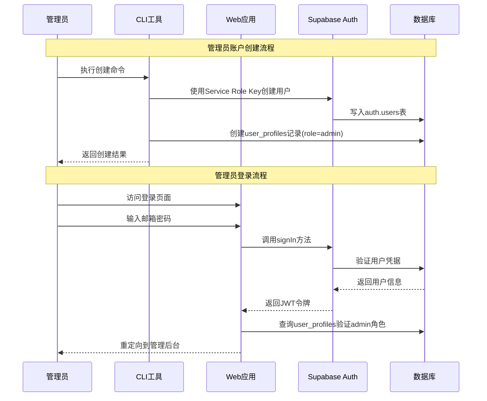

# WebVault 管理员认证系统 - 部署和使用指南

> **系统规范**: admin-only-auth-system  
> **版本**: v1.0.0  
> **最后更新**: 2025-08-19

## 📋 目录

- [系统概述](#系统概述)
- [架构说明](#架构说明)
- [环境要求](#环境要求)
- [部署指南](#部署指南)
- [管理员账户管理](#管理员账户管理)
- [安全配置](#安全配置)
- [故障排除](#故障排除)
- [监控和维护](#监控和维护)
- [最佳实践](#最佳实践)

## 系统概述

WebVault 管理员认证系统是一个**仅限管理员**的安全认证解决方案，专为内容管理平台设计。系统通过禁用公开用户注册，确保只有经过授权的管理员能够访问平台管理功能。

### 核心特性

- **管理员专用访问**: 完全禁用公开用户注册功能
- **CLI工具管理**: 通过命令行工具创建和管理管理员账户
- **安全认证**: 基于Supabase Auth的企业级认证系统
- **角色控制**: 严格的角色权限管理（仅admin角色）
- **审计日志**: 完整的管理员操作记录和审计功能

### 适用场景

- 企业内部内容管理系统
- 需要严格访问控制的网站目录平台
- 多管理员协作的内容策展系统
- 需要审计合规的管理平台

## 架构说明

### 技术架构

```
┌─────────────────────────────────────────────────────────────┐
│                    WebVault 管理员认证系统                     │
├─────────────────────────────────────────────────────────────┤
│  前端层 (Next.js 15 + React 19)                             │
│  ├── 管理员登录界面                                           │
│  ├── 管理后台界面                                             │
│  └── 认证守卫和路由保护                                        │
├─────────────────────────────────────────────────────────────┤
│  认证服务层 (Supabase Auth + 抽象接口)                        │
│  ├── SupabaseAuthService: Supabase认证实现                   │
│  ├── AuthService Interface: 认证服务抽象接口                  │
│  └── AuthGuard: 路由级别的访问控制                            │
├─────────────────────────────────────────────────────────────┤
│  CLI工具层 (Node.js + TypeScript)                           │
│  ├── 管理员账户创建 (create-admin.ts)                         │
│  ├── 管理员账户查询 (list-admins.ts)                          │
│  └── 管理员账户管理 (manage-admin.ts)                         │
├─────────────────────────────────────────────────────────────┤
│  数据层 (Supabase PostgreSQL + RLS)                         │
│  ├── auth.users: Supabase内置用户表                          │
│  ├── user_profiles: 扩展用户信息表                            │
│  └── RLS策略: 行级安全控制                                    │
└─────────────────────────────────────────────────────────────┘
```

### 认证流程



## 环境要求

### 系统要求

- **Node.js**: v18.0.0 或更高版本
- **npm**: v8.0.0 或更高版本
- **操作系统**: macOS, Linux, Windows (WSL2推荐)

### 必需服务

- **Supabase项目**: 已创建的Supabase项目实例
- **PostgreSQL数据库**: 通过Supabase托管
- **SMTP服务**: 用于密码重置邮件发送

### 开发工具

```bash
# 确保已安装必需的开发依赖
npm install --save-dev tsx dotenv-cli typescript
```

## 部署指南

### 步骤1: 克隆和安装

```bash
# 克隆项目仓库
git clone <repository-url>
cd WebVault

# 安装项目依赖
npm install

# 安装CLI工具依赖
npm install --save-dev tsx dotenv-cli
```

### 步骤2: 环境变量配置

复制环境变量模板并填入实际值：

```bash
# 复制环境变量模板
cp .env.example .env.local

# 编辑环境变量文件
nano .env.local
```

**必需的环境变量配置**：

```bash
# ============================================================================
# Supabase 配置（必需）
# ============================================================================

# 你的Supabase项目URL
NEXT_PUBLIC_SUPABASE_URL=https://your-project.supabase.co

# 你的Supabase anon/public密钥
NEXT_PUBLIC_SUPABASE_ANON_KEY=eyJhbGciOiJIUzI1NiIsInR5cCI6IkpXVCJ9...

# 你的Supabase service role密钥 (⚠️ 高权限密钥，请妥善保管)
SUPABASE_SERVICE_ROLE_KEY=eyJhbGciOiJIUzI1NiIsInR5cCI6IkpXVCJ9...

# ============================================================================
# 站点配置
# ============================================================================

# 站点URL (用于OAuth回调)
NEXT_PUBLIC_SITE_URL=https://your-domain.com  # 生产环境
# NEXT_PUBLIC_SITE_URL=http://localhost:3000   # 开发环境

# 应用URL
NEXT_PUBLIC_APP_URL=https://your-domain.com

# 运行环境
NODE_ENV=production

# ============================================================================
# 管理员CLI工具配置（可选）
# ============================================================================

# CLI工具日志级别
ADMIN_CLI_LOG_LEVEL=info

# 启用审计日志
ADMIN_CLI_AUDIT_LOG=true

# CLI超时设置（毫秒）
ADMIN_CLI_TIMEOUT=30000
```

### 步骤3: Supabase项目配置

按照 [Supabase Admin配置指南](./supabase-admin-config-guide.md) 完成以下配置：

1. **禁用公开注册**
   - Authentication > Settings > User signups
   - 关闭 "Allow new users to sign up"

2. **配置认证策略**
   - 设置密码复杂度要求
   - 配置会话超时时间
   - 启用刷新令牌轮换

3. **邮件模板配置**
   - 保留密码重置模板
   - 删除或禁用注册确认模板

### 步骤4: 数据库迁移

运行数据库迁移脚本创建必要的表结构：

```bash
# 验证数据库连接
npm run db:verify

# 执行数据库迁移（如需要）
npm run db:migration-helper

# 验证表结构
npm run db:test-structure
```

### 步骤5: 验证配置

```bash
# 验证Supabase配置
npm run admin:verify-config

# 测试CLI工具连接
npm run admin:help
```

### 步骤6: 创建首个管理员账户

```bash
# 创建管理员账户
npm run admin:create -- --email=admin@yourdomain.com --password=SecurePass123 --name="Super Admin"

# 验证创建成功
npm run admin:list
```

### 步骤7: 构建和部署

```bash
# 类型检查
npm run type-check

# 构建生产版本
npm run build

# 启动生产服务
npm run start
```

## 管理员账户管理

### CLI工具概览

WebVault提供一套完整的CLI工具用于管理员账户管理：

```bash
# 查看所有可用命令
npm run admin:help
```

### 创建管理员账户

```bash
# 基本创建命令
npm run admin:create -- --email=admin@example.com --password=SecurePass123 --name="Admin User"

# 密码要求
# - 最少8个字符
# - 包含大写字母、小写字母和数字
# - 建议包含特殊字符

# 示例
npm run admin:create -- --email=admin@webvault.com --password=AdminSecure2024! --name="网站管理员"
```

**输出示例**：
```
✅ 管理员账户创建成功！邮箱: admin@webvault.com

📊 管理员信息:
   ID: 12345678-1234-1234-1234-123456789abc
   邮箱: admin@webvault.com
   姓名: 网站管理员
   角色: admin
   创建时间: 2025-08-19T10:30:41.216Z
```

### 查看管理员账户

```bash
# 列出所有管理员（表格格式）
npm run admin:list

# JSON格式输出
npm run admin:list -- --format=json

# 限制显示数量
npm run admin:list -- --limit=10

# 搜索特定邮箱
npm run admin:list -- --search=admin@example.com

# 分页显示
npm run admin:list -- --page=2 --limit=5
```

**表格输出示例**：
```
📋 管理员账户列表 (总计: 3)

┌──────────────────────────────────────┬─────────────────────┬─────────────┬────────┬──────────────────────┐
│ 管理员ID                              │ 邮箱地址              │ 姓名         │ 状态    │ 创建时间              │
├──────────────────────────────────────┼─────────────────────┼─────────────┼────────┼──────────────────────┤
│ 12345678-1234-1234-1234-123456789abc │ admin@webvault.com  │ 网站管理员   │ 活跃   │ 2025-08-19T10:30:41Z │
│ 87654321-4321-4321-4321-cba987654321 │ editor@webvault.com │ 内容编辑     │ 活跃   │ 2025-08-19T11:15:22Z │
└──────────────────────────────────────┴─────────────────────┴─────────────┴────────┴──────────────────────┘
```

### 更新管理员信息

```bash
# 更新管理员姓名
npm run admin:update -- --id=12345678-1234-1234-1234-123456789abc --name="新姓名"

# 更新邮箱地址
npm run admin:update -- --id=12345678-1234-1234-1234-123456789abc --email=new@example.com

# 同时更新姓名和邮箱
npm run admin:update -- --id=12345678-1234-1234-1234-123456789abc --name="更新的管理员" --email=updated@example.com
```

### 重置管理员密码

```bash
# 手动指定新密码
npm run admin:reset-password -- --email=admin@example.com --password=NewSecurePass123

# 自动生成强密码
npm run admin:reset-password -- --email=admin@example.com
```

**自动生成密码示例输出**：
```
🔐 密码重置成功！

📧 管理员邮箱: admin@example.com
🆕 新密码: TempPass2024!@#$
⚠️  请立即登录并修改密码

✉️ 密码重置邮件已发送到管理员邮箱
```

### 检查管理员状态

```bash
# 查看管理员详细状态
npm run admin:status -- --email=admin@example.com
```

**状态输出示例**：
```
👤 管理员状态详情

📧 邮箱: admin@example.com
🆔 ID: 12345678-1234-1234-1234-123456789abc
👨‍💼 姓名: 网站管理员
🔐 状态: 活跃
📅 创建时间: 2025-08-19T10:30:41.216Z
🕐 最后登录: 2025-08-19T14:22:15.891Z
🔑 邮箱已验证: 是
🛡️ 角色: admin
```

### 删除管理员账户

```bash
# 交互式删除（需要确认）
npm run admin:delete -- --id=12345678-1234-1234-1234-123456789abc

# 直接删除（跳过确认）
npm run admin:delete -- --id=12345678-1234-1234-1234-123456789abc --confirm
```

**⚠️ 重要提醒**：删除操作不可撤销，请谨慎操作。

### 解锁管理员账户

```bash
# 解锁被锁定的管理员账户
npm run admin:unlock -- --email=admin@example.com
```

## 安全配置

### 环境变量安全

**生产环境安全清单**：

```bash
# 1. 确保环境变量不被版本控制
echo ".env.local" >> .gitignore
echo ".env.production" >> .gitignore

# 2. 设置文件权限（仅所有者可读写）
chmod 600 .env.local

# 3. 定期轮换Service Role Key
# 在Supabase Dashboard > Settings > API 中重新生成
```

### Supabase安全配置

**必需的安全设置**：

1. **RLS (Row Level Security)**: 确保已启用
2. **API访问限制**: 限制未经授权的API访问
3. **JWT密钥轮换**: 建议每90天轮换一次
4. **会话安全**: 启用HTTPS only模式

**检查命令**：
```bash
# 验证Supabase安全配置
npm run admin:verify-config
```

### 密码策略

**推荐的密码策略**：

- **最小长度**: 8字符
- **复杂度要求**: 至少包含大小写字母和数字
- **密码历史**: 防止重复使用最近5个密码
- **密码过期**: 90天（管理员账户）

### 会话管理

**推荐的会话配置**：

```toml
# supabase/config.toml
[auth]
jwt_expiry = 2592000  # 30天
enable_refresh_token_rotation = true
refresh_token_reuse_interval = 10
```

### 监控和审计

**审计日志启用**：

```bash
# 在.env.local中启用审计日志
ADMIN_CLI_AUDIT_LOG=true
ADMIN_CLI_LOG_LEVEL=info
```

**监控项目**：

- 异常登录尝试
- Service Role Key使用情况
- 管理员账户创建/删除活动
- API访问模式

## 故障排除

### 常见问题解决方案

#### 1. 管理员无法登录

**症状**: 管理员输入正确凭据但登录失败

**检查步骤**：

```bash
# 1. 检查管理员账户状态
npm run admin:status -- --email=admin@example.com

# 2. 验证环境变量配置
npm run admin:verify-config

# 3. 检查JWT过期设置
# 查看supabase/config.toml中的jwt_expiry配置

# 4. 确认用户在user_profiles表中存在且role='admin'
# 通过Supabase Dashboard > Table Editor查看
```

**解决方案**：

```bash
# 如果账户被锁定
npm run admin:unlock -- --email=admin@example.com

# 如果密码问题
npm run admin:reset-password -- --email=admin@example.com

# 如果用户记录丢失，重新创建
npm run admin:create -- --email=admin@example.com --password=NewPass123 --name="Admin User"
```

#### 2. CLI工具连接失败

**症状**: CLI命令执行时报告连接错误

**检查步骤**：

```bash
# 1. 验证环境变量
cat .env.local | grep SUPABASE

# 2. 测试网络连接
curl -I https://your-project.supabase.co

# 3. 验证Service Role Key权限
npm run admin:verify-config
```

**解决方案**：

```bash
# 1. 确保SUPABASE_SERVICE_ROLE_KEY正确配置
# 从Supabase Dashboard > Settings > API获取最新密钥

# 2. 检查防火墙设置
# 确保443端口出站连接可用

# 3. 重新安装CLI依赖
npm install --save-dev tsx dotenv-cli
```

#### 3. 邮件模板不工作

**症状**: 密码重置邮件未发送

**检查步骤**：

1. 在Supabase Dashboard验证SMTP配置
2. 检查邮件模板语法
3. 确认邮件服务提供商设置

**解决方案**：

```bash
# 测试邮件发送
npm run admin:reset-password -- --email=test@example.com

# 检查Supabase日志
# Dashboard > Logs > Auth logs
```

#### 4. 数据库迁移问题

**症状**: 数据库表不存在或结构不正确

**解决方案**：

```bash
# 1. 验证数据库结构
npm run db:test-structure

# 2. 手动执行迁移
npm run db:migration-helper

# 3. 如果问题持续，检查迁移文件
cat supabase/migrations/20250118120000_admin_auth_system.sql
```

### 错误代码对照表

| 错误代码 | 错误信息 | 解决方案 |
|---------|---------|----------|
| `AUTH001` | `SUPABASE_SERVICE_ROLE_KEY not found` | 检查.env.local文件中的环境变量配置 |
| `AUTH002` | `Invalid email format` | 使用有效的邮箱格式 |
| `AUTH003` | `Password does not meet requirements` | 使用符合密码策略的密码 |
| `AUTH004` | `User already exists` | 邮箱已被使用，使用其他邮箱或更新现有账户 |
| `AUTH005` | `User not found` | 指定的用户不存在，检查邮箱地址或ID |
| `DB001` | `Table user_profiles does not exist` | 运行数据库迁移脚本 |
| `DB002` | `RLS policy violation` | 检查行级安全策略配置 |

### 日志分析

**启用详细日志**：

```bash
# 设置调试级别日志
export ADMIN_CLI_LOG_LEVEL=debug

# 执行命令查看详细输出
npm run admin:status -- --email=admin@example.com
```

**日志文件位置**：

- CLI操作日志: 控制台输出
- Supabase认证日志: Supabase Dashboard > Logs
- 应用程序日志: Next.js控制台输出

## 监控和维护

### 定期维护清单

**每周检查**：

```bash
# 1. 检查管理员账户状态
npm run admin:list

# 2. 验证系统配置
npm run admin:verify-config

# 3. 查看异常登录日志
# 在Supabase Dashboard > Logs > Auth logs查看
```

**每月检查**：

```bash
# 1. 轮换JWT Secret（在Supabase Dashboard操作）
# Settings > API > JWT Settings > Regenerate

# 2. 检查Service Role Key使用情况
# Dashboard > Logs > API logs

# 3. 审核管理员账户权限
npm run admin:list -- --format=json > admin_audit_$(date +%Y%m%d).json

# 4. 更新密码（建议管理员主动更新）
npm run admin:reset-password -- --email=admin@example.com
```

**季度检查**：

```bash
# 1. 更新依赖包
npm audit
npm update

# 2. 检查安全漏洞
npm audit fix

# 3. 备份环境变量配置
cp .env.local .env.backup.$(date +%Y%m%d)

# 4. 性能测试
npm run test:performance:auth
```

### 监控指标

**关键指标**：

1. **认证成功率**: > 99%
2. **管理员账户数量**: 根据团队规模
3. **异常登录尝试**: < 5/天
4. **CLI工具响应时间**: < 5秒
5. **密码重置频率**: < 1次/月/用户

**监控工具**：

```bash
# 使用Supabase内置监控
# Dashboard > Observability

# 或集成外部监控（如有需要）
# - Prometheus + Grafana
# - DataDog
# - New Relic
```

### 备份策略

**环境变量备份**：

```bash
# 定期备份环境变量（移除敏感信息）
cp .env.local .env.backup.$(date +%Y%m%d)

# 压缩并加密备份
tar -czf env_backup_$(date +%Y%m%d).tar.gz .env.backup.*
gpg --symmetric env_backup_$(date +%Y%m%d).tar.gz
```

**数据库备份**：

```bash
# Supabase自动备份（Dashboard > Settings > Backups）
# 可以下载每日备份文件

# 自定义备份脚本（如需要）
# pg_dump -h your-project.supabase.co -U postgres your_db > backup_$(date +%Y%m%d).sql
```

### 容灾恢复

**恢复计划**：

1. **环境变量恢复**: 从备份恢复.env.local文件
2. **数据库恢复**: 使用Supabase备份恢复功能
3. **管理员账户恢复**: 使用CLI工具重新创建关键管理员
4. **应用重新部署**: 重新构建和部署应用

**测试恢复流程**：

```bash
# 模拟环境变量丢失
mv .env.local .env.local.backup

# 从备份恢复
cp .env.backup.YYYYMMDD .env.local

# 验证系统功能
npm run admin:verify-config
npm run admin:list
```

## 最佳实践

### 安全最佳实践

1. **最小权限原则**
   - 仅创建必要的管理员账户
   - 定期审核管理员权限
   - 及时删除不活跃账户

2. **凭据管理**
   - 使用强密码策略
   - 启用双因素认证（如支持）
   - 定期更换密码

3. **环境隔离**
   - 开发、测试、生产环境分离
   - 不同环境使用不同的Supabase项目
   - 严格控制生产环境访问

4. **监控和审计**
   - 启用详细的操作日志
   - 设置异常行为告警
   - 定期审核访问日志

### 运维最佳实践

1. **自动化部署**
   ```bash
   # 使用CI/CD管道自动化部署
   # 示例：GitHub Actions workflow
   name: Deploy WebVault
   on:
     push:
       branches: [main]
   jobs:
     deploy:
       runs-on: ubuntu-latest
       steps:
         - uses: actions/checkout@v2
         - name: Setup Node.js
           uses: actions/setup-node@v2
           with:
             node-version: '18'
         - run: npm ci
         - run: npm run build
         - run: npm run test
   ```

2. **版本管理**
   ```bash
   # 使用语义化版本控制
   git tag v1.0.0
   git push origin v1.0.0
   
   # 发布说明
   git log --oneline v0.9.0..v1.0.0 > CHANGELOG.md
   ```

3. **文档维护**
   - 及时更新部署文档
   - 记录配置变更
   - 维护故障排除指南

### 开发最佳实践

1. **代码质量**
   ```bash
   # 使用TypeScript严格模式
   npm run type-check
   
   # 代码格式化
   npm run lint
   
   # 运行测试
   npm run test
   ```

2. **错误处理**
   ```typescript
   // 示例：CLI工具错误处理
   try {
     const result = await createAdmin(email, password, name);
     console.log('✅ 管理员创建成功', result);
   } catch (error) {
     console.error('❌ 创建失败:', error.message);
     process.exit(1);
   }
   ```

3. **性能优化**
   ```bash
   # 定期运行性能测试
   npm run test:performance:auth
   
   # 监控包大小
   npm run build
   
   # 分析构建产物
   npx @next/bundle-analyzer
   ```

### 团队协作最佳实践

1. **权限分级**
   - 超级管理员：全部权限
   - 内容管理员：内容相关权限
   - 审核员：审核相关权限

2. **操作规范**
   - 重要操作需要双人确认
   - 记录操作原因和时间
   - 定期团队安全培训

3. **沟通机制**
   - 建立紧急联系方式
   - 定期安全状况报告
   - 及时分享安全最佳实践

## 附录

### 相关文档

- [Supabase Admin配置指南](./supabase-admin-config-guide.md)
- [管理员CLI工具说明](../scripts/admin/README.md)
- [项目开发文档](./README.md)
- [WebVault架构文档](../CLAUDE.md)

### 支持和联系

如遇到问题或需要支持，请：

1. 查阅本文档的故障排除部分
2. 检查[GitHub Issues](https://github.com/your-repo/issues)
3. 联系系统管理员
4. 提交新的Issue报告

### 更新历史

| 版本 | 日期 | 更新内容 |
|------|------|----------|
| v1.0.0 | 2025-08-19 | 初始版本，完整的部署和使用指南 |

---

**⚠️ 重要提醒**: 此文档包含敏感的系统配置信息，请妥善保管，仅供授权人员查阅。

**📞 紧急联系**: 如遇紧急安全问题，请立即联系系统管理员。

---

*WebVault 管理员认证系统 - 让内容管理更安全、更高效*