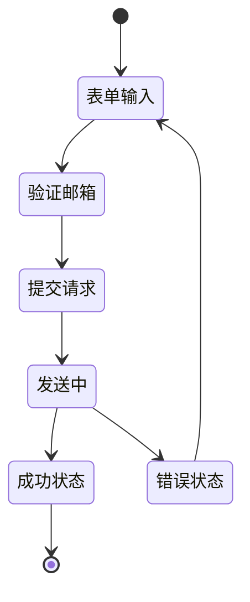

# PasswordResetPage Component

## 概述

PasswordResetPage 是一个用于处理密码重置请求的完整页面组件。它提供了邮箱输入表单、验证、提交处理，以及用户友好的反馈机制。

## 功能特性

### 🔐 核心功能
- **邮箱输入和验证** - 实时邮箱格式验证
- **密码重置请求** - 集成Supabase Auth密码重置功能
- **加载状态管理** - 完整的UI状态反馈
- **错误处理** - 友好的错误提示和恢复机制
- **成功状态展示** - 清晰的成功确认和后续步骤指引

### 🎨 用户体验
- **响应式设计** - 支持桌面端和移动端
- **一致的视觉风格** - 与登录页面保持一致
- **无障碍支持** - 完整的键盘导航和屏幕阅读器支持
- **主题集成** - 支持亮色/暗色主题切换

### 🛡️ 安全特性
- **XSS防护** - 输入内容安全验证
- **蜜罐字段** - 反机器人提交检测
- **隐私保护** - 不泄露邮箱是否存在的信息
- **速率限制** - 防止恶意重复请求

## 技术实现

### 依赖关系
- **usePasswordResetForm** - 表单状态管理
- **AuthLayout** - 一致的页面布局
- **shadcn/ui** - 基础UI组件
- **Zod + React Hook Form** - 表单验证
- **Supabase Auth** - 密码重置服务

### 组件架构
```
PasswordResetPage
├── AuthLayout (布局容器)
├── Form (表单处理)
│   ├── EmailInput (邮箱输入)
│   └── SubmitButton (提交按钮)
├── SuccessState (成功状态展示)
└── ErrorHandling (错误处理)
```

## 使用方法

### 基础用法
```tsx
import { PasswordResetPage } from '@/features/auth';

function ResetPage() {
  return (
    <PasswordResetPage
      onSuccess={(result) => {
        console.log('重置邮件已发送:', result.email);
      }}
      onError={(error) => {
        console.error('重置失败:', error);
      }}
      onBackToLogin={() => {
        // 导航到登录页面
      }}
    />
  );
}
```

### 完整配置
```tsx
<PasswordResetPage
  className="custom-styles"
  onSuccess={handleSuccess}
  onError={handleError}
  onBackToLogin={handleBackToLogin}
  returnUrl="/dashboard"
  autoFocus={true}
  debug={false}
/>
```

## API 接口

### Props

| 属性 | 类型 | 默认值 | 描述 |
|------|------|--------|------|
| `className` | `string` | - | 自定义CSS类名 |
| `onSuccess` | `(result) => void` | - | 成功回调函数 |
| `onError` | `(error) => void` | - | 错误回调函数 |
| `onBackToLogin` | `() => void` | - | 返回登录回调 |
| `returnUrl` | `string` | - | 重置后返回URL |
| `autoFocus` | `boolean` | `true` | 自动聚焦邮箱输入框 |
| `debug` | `boolean` | `false` | 调试模式 |

### 回调参数

**onSuccess 参数**
```typescript
{
  success: boolean;
  email: string;
}
```

**onError 参数**
```typescript
error: string // 错误消息
```

## 状态流程



## 最佳实践

### 1. 错误处理
```tsx
const handleError = (error: string) => {
  // 记录错误日志
  console.error('Password reset error:', error);
  
  // 显示用户友好的错误提示
  toast.error('密码重置请求失败，请重试');
  
  // 可选：发送错误报告
  analytics.track('password_reset_error', { error });
};
```

### 2. 成功处理
```tsx
const handleSuccess = (result: { success: boolean; email: string }) => {
  // 显示成功提示
  toast.success(`重置邮件已发送到 ${result.email}`);
  
  // 记录成功事件
  analytics.track('password_reset_requested', { 
    email: result.email 
  });
  
  // 可选：保存状态用于后续流程
  sessionStorage.setItem('reset_email', result.email);
};
```

### 3. 导航集成
```tsx
import { useRouter } from 'next/navigation';

function PasswordResetRoute() {
  const router = useRouter();
  
  return (
    <PasswordResetPage
      onBackToLogin={() => router.push('/login')}
      onSuccess={() => {
        // 可以选择停留在当前页面或导航
        // router.push('/login?message=reset_sent');
      }}
    />
  );
}
```

## 国际化支持

组件内的文本可以通过国际化系统进行本地化：

```tsx
// 未来可以集成 react-i18next 或其他国际化方案
const t = useTranslation();

<PasswordResetPage
  // 传递本地化的消息
/>
```

## 样式定制

### CSS 变量
```css
.password-reset-page {
  --reset-primary-color: hsl(var(--primary));
  --reset-success-color: hsl(var(--success));
  --reset-error-color: hsl(var(--destructive));
}
```

### 自定义主题
```tsx
<PasswordResetPage
  className="custom-theme dark:bg-slate-900"
/>
```

## 性能优化

1. **懒加载** - 组件支持动态导入
2. **内存管理** - 自动清理表单状态
3. **防抖处理** - 内置输入验证防抖
4. **网络优化** - 智能重试机制

## 测试建议

### 单元测试
- 表单验证逻辑
- 成功/错误状态处理
- 用户交互响应

### 集成测试
- 完整密码重置流程
- 错误恢复机制
- 导航集成

### E2E测试
- 真实邮件发送
- 多设备响应式测试
- 无障碍功能验证